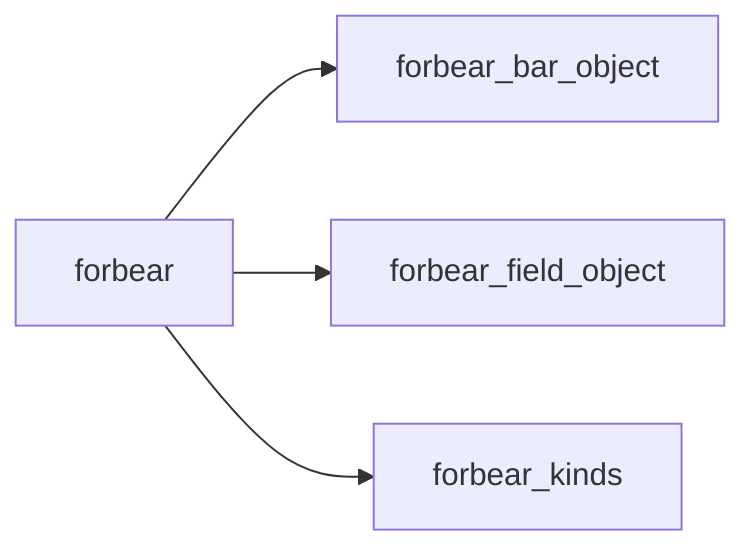

# forbear

**Source**: `src/lib/forbear.f90`

**Dependencies**

```mermaid
graph LR
  forbear["forbear"] --> forbear_bar_object["forbear_bar_object"]
  forbear["forbear"] --> forbear_field_object["forbear_field_object"]
  forbear["forbear"] --> forbear_kinds["forbear_kinds"]
```
