# forbear_bar_object

**Source**: `src/lib/forbear_bar_object.F90`

**Dependencies**

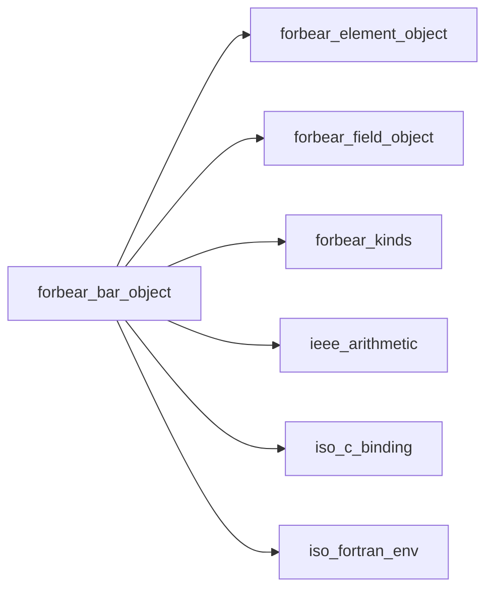

## Contents

- [token_object](#token-object)
- [field_entry](#field-entry)
- [bar_object](#bar-object)
- [isatty](#isatty)
- [destroy](#destroy)
- [initialize](#initialize)
- [start](#start)
- [update](#update)
- [suspend](#suspend)
- [resume](#resume)
- [finish](#finish)
- [write_message](#write-message)
- [draw_progress](#draw-progress)
- [build_frame](#build-frame)
- [measure](#measure)
- [add_field](#add-field)
- [add_token](#add-token)
- [default_layout](#default-layout)
- [parse_template](#parse-template)
- [parse_zones](#parse-zones)
- [parse_trail](#parse-trail)
- [resolve_fields](#resolve-fields)
- [complete](#complete)
- [draw](#draw)
- [update_rate](#update-rate)
- [create_spinner](#create-spinner)
- [template_error](#template-error)
- [zones_error](#zones-error)
- [is_stdout_locked](#is-stdout-locked)
- [bar_body](#bar-body)
- [cell_zone](#cell-zone)
- [lit_cells](#lit-cells)
- [scanner_body](#scanner-body)
- [unlit_cells](#unlit-cells)
- [progress_state](#progress-state)
- [width_before_bar](#width-before-bar)
- [compact_real](#compact-real)
- [count_text](#count-text)
- [done_text](#done-text)
- [pulse_phase](#pulse-phase)
- [ramp_level](#ramp-level)
- [display_width](#display-width)
- [styled](#styled)
- [token_kind](#token-kind)
- [duration](#duration)
- [get_environment](#get-environment)
- [hms](#hms)
- [is_terminal](#is-terminal)
- [render](#render)

## Variables

| Name | Type | Attributes | Description |
|------|------|------------|-------------|
| `ESC` | character(len=1) | parameter |  |
| `CR` | character(len=1) | parameter |  |
| `LF` | character(len=1) | parameter |  |
| `FULL_BLOCK` | character(len=*) | parameter |  |
| `PARTIAL_BLOCKS` | character(len=*) | parameter |  |
| `RAMP_BLOCKS` | character(len=*) | parameter |  |
| `PROFILE_FLAT` | integer(kind=I4P) | parameter |  |
| `PROFILE_RAMP` | integer(kind=I4P) | parameter |  |
| `TOKEN_TEXT` | integer(kind=I4P) | parameter |  |
| `TOKEN_BAR` | integer(kind=I4P) | parameter |  |
| `TOKEN_SPINNER` | integer(kind=I4P) | parameter |  |
| `TOKEN_PERCENT` | integer(kind=I4P) | parameter |  |
| `TOKEN_COUNT` | integer(kind=I4P) | parameter |  |
| `TOKEN_SPEED` | integer(kind=I4P) | parameter |  |
| `TOKEN_ETA` | integer(kind=I4P) | parameter |  |
| `TOKEN_ELAPSED` | integer(kind=I4P) | parameter |  |
| `TOKEN_MESSAGE` | integer(kind=I4P) | parameter |  |
| `TOKEN_PREFIX` | integer(kind=I4P) | parameter |  |
| `TOKEN_SUFFIX` | integer(kind=I4P) | parameter |  |
| `TOKEN_FIELD` | integer(kind=I4P) | parameter |  |

## Derived Types

### token_object

#### Components

| Name | Type | Attributes | Description |
|------|------|------------|-------------|
| `kind` | integer(kind=I4P) |  |  |
| `decorated` | logical |  |  |
| `name` | character(len=:) | allocatable |  |
| `field` | integer(kind=I4P) |  |  |
| `style` | type([element_object](/api/src/lib/forbear_element_object#element-object)) |  |  |

### field_entry

#### Components

| Name | Type | Attributes | Description |
|------|------|------------|-------------|
| `name` | character(len=:) | allocatable |  |
| `field` | class([field_object](/api/src/lib/forbear_field_object#field-object)) | allocatable |  |

### bar_object

#### Components

| Name | Type | Attributes | Description |
|------|------|------------|-------------|
| `prefix` | type([element_object](/api/src/lib/forbear_element_object#element-object)) |  |  |
| `suffix` | type([element_object](/api/src/lib/forbear_element_object#element-object)) |  |  |
| `bracket_left` | type([element_object](/api/src/lib/forbear_element_object#element-object)) |  |  |
| `bracket_right` | type([element_object](/api/src/lib/forbear_element_object#element-object)) |  |  |
| `empty_char` | type([element_object](/api/src/lib/forbear_element_object#element-object)) |  |  |
| `filled_char` | type([element_object](/api/src/lib/forbear_element_object#element-object)) |  |  |
| `progress_percent` | type([element_object](/api/src/lib/forbear_element_object#element-object)) |  |  |
| `progress_count` | type([element_object](/api/src/lib/forbear_element_object#element-object)) |  |  |
| `progress_speed` | type([element_object](/api/src/lib/forbear_element_object#element-object)) |  |  |
| `eta` | type([element_object](/api/src/lib/forbear_element_object#element-object)) |  |  |
| `message` | type([element_object](/api/src/lib/forbear_element_object#element-object)) |  |  |
| `scale_bar` | type([element_object](/api/src/lib/forbear_element_object#element-object)) |  |  |
| `date_time` | type([element_object](/api/src/lib/forbear_element_object#element-object)) |  |  |
| `summary` | type([element_object](/api/src/lib/forbear_element_object#element-object)) |  |  |
| `spinner` | type([element_object](/api/src/lib/forbear_element_object#element-object)) | allocatable |  |
| `zone_limit` | real(kind=R8P) | allocatable |  |
| `zone_char` | type([element_object](/api/src/lib/forbear_element_object#element-object)) | allocatable |  |
| `trail_char` | type([element_object](/api/src/lib/forbear_element_object#element-object)) | allocatable |  |
| `width` | integer(kind=I4P) |  |  |
| `min_value` | real(kind=R8P) |  |  |
| `max_value` | real(kind=R8P) |  |  |
| `frequency` | integer(kind=I4P) |  |  |
| `min_interval` | real(kind=R8P) |  |  |
| `log_interval` | real(kind=R8P) |  |  |
| `smoothing` | real(kind=R8P) |  |  |
| `position` | integer(kind=I4P) |  |  |
| `add_scale_bar` | logical |  |  |
| `add_progress_percent` | logical |  |  |
| `add_progress_count` | logical |  |  |
| `add_progress_speed` | logical |  |  |
| `add_eta` | logical |  |  |
| `add_date_time` | logical |  |  |
| `add_summary` | logical |  |  |
| `partial_blocks` | logical |  |  |
| `profile` | integer(kind=I4P) |  |  |
| `indeterminate` | logical |  |  |
| `is_interactive_` | logical |  |  |
| `is_disabled_` | logical |  |  |
| `hide_cursor` | logical |  |  |
| `is_stdout_locked_` | logical |  |  |
| `output_unit` | integer(kind=I4P) |  |  |
| `progress_drawn_` | integer(kind=I4P) |  |  |
| `fraction_drawn_` | real(kind=R8P) |  |  |
| `rate_` | real(kind=R8P) |  |  |
| `rate_samples_` | integer(kind=I4P) |  |  |
| `tic_` | integer(kind=I8P) |  |  |
| `tic_start_` | integer(kind=I8P) |  |  |
| `spinner_count_` | integer(kind=I4P) |  |  |
| `date_time_start_` | character(len=18) |  |  |
| `is_complete_` | logical |  |  |
| `current_` | real(kind=R8P) |  |  |
| `pulse_` | integer(kind=I4P) |  |  |
| `is_suspended_` | logical |  |  |
| `frame_` | character(kind=[UCS4](/api/src/lib/forbear_kinds), len=:) | allocatable |  |
| `tokens_` | type([token_object](/api/src/lib/forbear_bar_object#token-object)) | allocatable |  |
| `fields_` | type([field_entry](/api/src/lib/forbear_bar_object#field-entry)) | allocatable |  |
| `has_template_` | logical |  |  |
| `template_` | character(len=:) | allocatable |  |

#### Type-Bound Procedures

| Name | Attributes | Description |
|------|------------|-------------|
| `add_field` | pass(self) |  |
| `destroy` | pass(self) |  |
| `finish` | pass(self) |  |
| `initialize` | pass(self) |  |
| `is_stdout_locked` | pass(self) |  |
| `resume` | pass(self) |  |
| `start` | pass(self) |  |
| `suspend` | pass(self) |  |
| `update` | pass(self) |  |
| `write` | pass(self) |  |
| `add_token` | pass(self) |  |
| `bar_body` | pass(self) |  |
| `build_frame` | pass(self) |  |
| `cell_zone` | pass(self) |  |
| `lit_cells` | pass(self) |  |
| `unlit_cells` | pass(self) |  |
| `parse_zones` | pass(self) |  |
| `parse_trail` | pass(self) |  |
| `scanner_body` | pass(self) |  |
| `default_layout` | pass(self) |  |
| `parse_template` | pass(self) |  |
| `measure` | pass(self) |  |
| `progress_state` | pass(self) |  |
| `resolve_fields` | pass(self) |  |
| `width_before_bar` | pass(self) |  |
| `complete` | pass(self) |  |
| `create_spinner` | pass(self) |  |
| `draw` | pass(self) |  |
| `draw_progress` | pass(self) |  |
| `update_rate` | pass(self) |  |

## Interfaces

### isatty

## Subroutines

### destroy

**Attributes**: pure

```fortran
subroutine destroy(self)
```

**Arguments**

| Name | Type | Intent | Attributes | Description |
|------|------|--------|------------|-------------|
| `self` | class([bar_object](/api/src/lib/forbear_bar_object#bar-object)) | inout |  |  |

**Call graph**

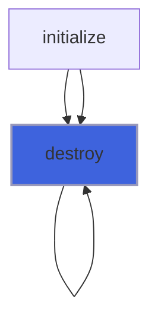

### initialize

```fortran
subroutine initialize(self, prefix_string, prefix_color_fg, prefix_color_bg, prefix_style, suffix_string, suffix_color_fg, suffix_color_bg, suffix_style, bracket_left_string, bracket_left_color_fg, bracket_left_color_bg, bracket_left_style, bracket_right_string, bracket_right_color_fg, bracket_right_color_bg, bracket_right_style, empty_char_string, empty_char_color_fg, empty_char_color_bg, empty_char_style, filled_char_string, filled_char_color_fg, filled_char_color_bg, filled_char_style, spinner_string, spinner_color_fg, spinner_color_bg, spinner_style, add_scale_bar, scale_bar_color_fg, scale_bar_color_bg, scale_bar_style, add_progress_percent, progress_percent_color_fg, progress_percent_color_bg, progress_percent_style, add_progress_count, progress_count_color_fg, progress_count_color_bg, progress_count_style, add_progress_speed, progress_speed_color_fg, progress_speed_color_bg, progress_speed_style, add_eta, eta_color_fg, eta_color_bg, eta_style, add_date_time, date_time_color_fg, date_time_color_bg, date_time_style, add_summary, summary_color_fg, summary_color_bg, summary_style, message_color_fg, message_color_bg, message_style, width, min_value, max_value, frequency, min_interval, smoothing, partial_blocks, position, interactive, disabled, hide_cursor, template, indeterminate, log_interval, output_unit, bar_zones, bar_profile, pulse_trail)
```

**Arguments**

| Name | Type | Intent | Attributes | Description |
|------|------|--------|------------|-------------|
| `self` | class([bar_object](/api/src/lib/forbear_bar_object#bar-object)) | inout |  |  |
| `prefix_string` | class(*) | in | optional |  |
| `prefix_color_fg` | character(len=*) | in | optional |  |
| `prefix_color_bg` | character(len=*) | in | optional |  |
| `prefix_style` | character(len=*) | in | optional |  |
| `suffix_string` | class(*) | in | optional |  |
| `suffix_color_fg` | character(len=*) | in | optional |  |
| `suffix_color_bg` | character(len=*) | in | optional |  |
| `suffix_style` | character(len=*) | in | optional |  |
| `bracket_left_string` | class(*) | in | optional |  |
| `bracket_left_color_fg` | character(len=*) | in | optional |  |
| `bracket_left_color_bg` | character(len=*) | in | optional |  |
| `bracket_left_style` | character(len=*) | in | optional |  |
| `bracket_right_string` | class(*) | in | optional |  |
| `bracket_right_color_fg` | character(len=*) | in | optional |  |
| `bracket_right_color_bg` | character(len=*) | in | optional |  |
| `bracket_right_style` | character(len=*) | in | optional |  |
| `empty_char_string` | class(*) | in | optional |  |
| `empty_char_color_fg` | character(len=*) | in | optional |  |
| `empty_char_color_bg` | character(len=*) | in | optional |  |
| `empty_char_style` | character(len=*) | in | optional |  |
| `filled_char_string` | class(*) | in | optional |  |
| `filled_char_color_fg` | character(len=*) | in | optional |  |
| `filled_char_color_bg` | character(len=*) | in | optional |  |
| `filled_char_style` | character(len=*) | in | optional |  |
| `spinner_string` | class(*) | in | optional |  |
| `spinner_color_fg` | character(len=*) | in | optional |  |
| `spinner_color_bg` | character(len=*) | in | optional |  |
| `spinner_style` | character(len=*) | in | optional |  |
| `add_scale_bar` | logical | in | optional |  |
| `scale_bar_color_fg` | character(len=*) | in | optional |  |
| `scale_bar_color_bg` | character(len=*) | in | optional |  |
| `scale_bar_style` | character(len=*) | in | optional |  |
| `add_progress_percent` | logical | in | optional |  |
| `progress_percent_color_fg` | character(len=*) | in | optional |  |
| `progress_percent_color_bg` | character(len=*) | in | optional |  |
| `progress_percent_style` | character(len=*) | in | optional |  |
| `add_progress_count` | logical | in | optional |  |
| `progress_count_color_fg` | character(len=*) | in | optional |  |
| `progress_count_color_bg` | character(len=*) | in | optional |  |
| `progress_count_style` | character(len=*) | in | optional |  |
| `add_progress_speed` | logical | in | optional |  |
| `progress_speed_color_fg` | character(len=*) | in | optional |  |
| `progress_speed_color_bg` | character(len=*) | in | optional |  |
| `progress_speed_style` | character(len=*) | in | optional |  |
| `add_eta` | logical | in | optional |  |
| `eta_color_fg` | character(len=*) | in | optional |  |
| `eta_color_bg` | character(len=*) | in | optional |  |
| `eta_style` | character(len=*) | in | optional |  |
| `add_date_time` | logical | in | optional |  |
| `date_time_color_fg` | character(len=*) | in | optional |  |
| `date_time_color_bg` | character(len=*) | in | optional |  |
| `date_time_style` | character(len=*) | in | optional |  |
| `add_summary` | logical | in | optional |  |
| `summary_color_fg` | character(len=*) | in | optional |  |
| `summary_color_bg` | character(len=*) | in | optional |  |
| `summary_style` | character(len=*) | in | optional |  |
| `message_color_fg` | character(len=*) | in | optional |  |
| `message_color_bg` | character(len=*) | in | optional |  |
| `message_style` | character(len=*) | in | optional |  |
| `width` | integer(kind=I4P) | in | optional |  |
| `min_value` | real(kind=R8P) | in | optional |  |
| `max_value` | real(kind=R8P) | in | optional |  |
| `frequency` | integer(kind=I4P) | in | optional |  |
| `min_interval` | real(kind=R8P) | in | optional |  |
| `smoothing` | real(kind=R8P) | in | optional |  |
| `partial_blocks` | logical | in | optional |  |
| `position` | integer(kind=I4P) | in | optional |  |
| `interactive` | logical | in | optional |  |
| `disabled` | logical | in | optional |  |
| `hide_cursor` | logical | in | optional |  |
| `template` | character(len=*) | in | optional |  |
| `indeterminate` | logical | in | optional |  |
| `log_interval` | real(kind=R8P) | in | optional |  |
| `output_unit` | integer(kind=I4P) | in | optional |  |
| `bar_zones` | character(len=*) | in | optional |  |
| `bar_profile` | character(len=*) | in | optional |  |
| `pulse_trail` | character(len=*) | in | optional |  |

**Call graph**

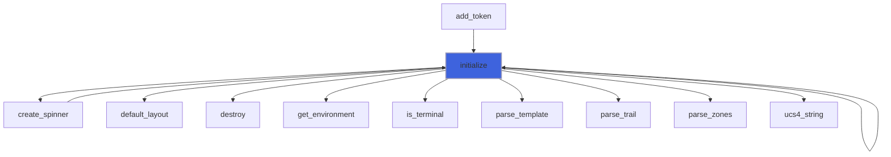

### start

```fortran
subroutine start(self)
```

**Arguments**

| Name | Type | Intent | Attributes | Description |
|------|------|--------|------------|-------------|
| `self` | class([bar_object](/api/src/lib/forbear_bar_object#bar-object)) | inout |  |  |

**Call graph**

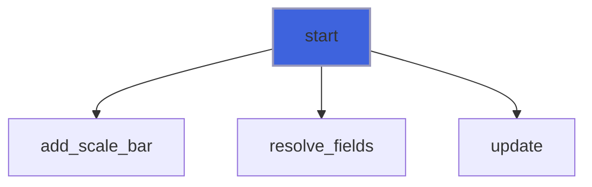

### update

```fortran
subroutine update(self, current, message)
```

**Arguments**

| Name | Type | Intent | Attributes | Description |
|------|------|--------|------------|-------------|
| `self` | class([bar_object](/api/src/lib/forbear_bar_object#bar-object)) | inout |  |  |
| `current` | real(kind=R8P) | in |  |  |
| `message` | class(*) | in | optional |  |

**Call graph**

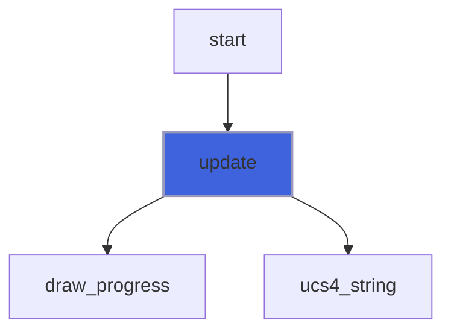

### suspend

```fortran
subroutine suspend(self)
```

**Arguments**

| Name | Type | Intent | Attributes | Description |
|------|------|--------|------------|-------------|
| `self` | class([bar_object](/api/src/lib/forbear_bar_object#bar-object)) | inout |  |  |

### resume

```fortran
subroutine resume(self)
```

**Arguments**

| Name | Type | Intent | Attributes | Description |
|------|------|--------|------------|-------------|
| `self` | class([bar_object](/api/src/lib/forbear_bar_object#bar-object)) | inout |  |  |

**Call graph**

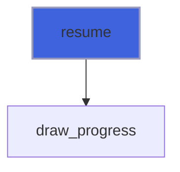

### finish

```fortran
subroutine finish(self, message)
```

**Arguments**

| Name | Type | Intent | Attributes | Description |
|------|------|--------|------------|-------------|
| `self` | class([bar_object](/api/src/lib/forbear_bar_object#bar-object)) | inout |  |  |
| `message` | class(*) | in | optional |  |

**Call graph**

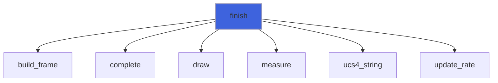

### write_message

```fortran
subroutine write_message(self, message)
```

**Arguments**

| Name | Type | Intent | Attributes | Description |
|------|------|--------|------------|-------------|
| `self` | class([bar_object](/api/src/lib/forbear_bar_object#bar-object)) | inout |  |  |
| `message` | class(*) | in |  |  |

**Call graph**

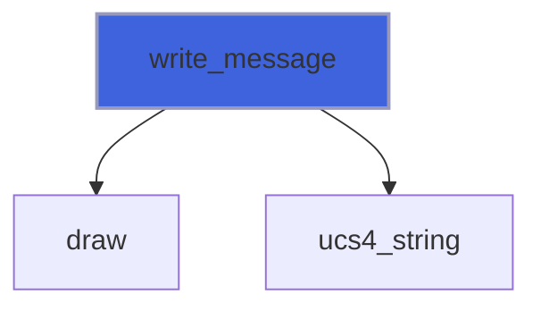

### draw_progress

```fortran
subroutine draw_progress(self, force)
```

**Arguments**

| Name | Type | Intent | Attributes | Description |
|------|------|--------|------------|-------------|
| `self` | class([bar_object](/api/src/lib/forbear_bar_object#bar-object)) | inout |  |  |
| `force` | logical | in |  |  |

**Call graph**

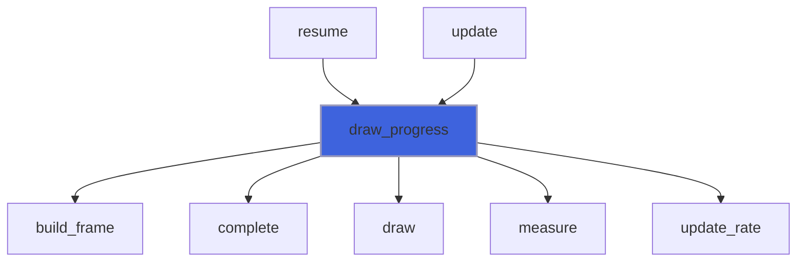

### build_frame

```fortran
subroutine build_frame(self, progress, fraction, elapsed)
```

**Arguments**

| Name | Type | Intent | Attributes | Description |
|------|------|--------|------------|-------------|
| `self` | class([bar_object](/api/src/lib/forbear_bar_object#bar-object)) | inout |  |  |
| `progress` | integer(kind=I4P) | in |  |  |
| `fraction` | real(kind=R8P) | in |  |  |
| `elapsed` | real(kind=R8P) | in |  |  |

**Call graph**

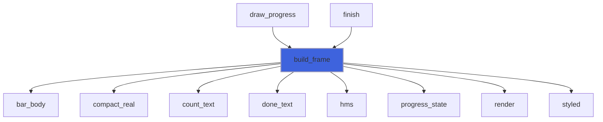

### measure

**Attributes**: pure

```fortran
subroutine measure(self, current, fraction, progress)
```

**Arguments**

| Name | Type | Intent | Attributes | Description |
|------|------|--------|------------|-------------|
| `self` | class([bar_object](/api/src/lib/forbear_bar_object#bar-object)) | in |  |  |
| `current` | real(kind=R8P) | in |  |  |
| `fraction` | real(kind=R8P) | out |  |  |
| `progress` | integer(kind=I4P) | out |  |  |

**Call graph**

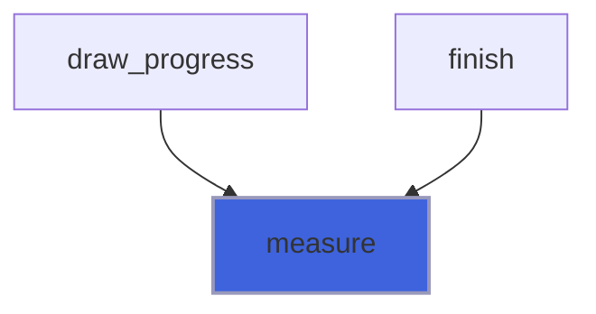

### add_field

```fortran
subroutine add_field(self, name, field)
```

**Arguments**

| Name | Type | Intent | Attributes | Description |
|------|------|--------|------------|-------------|
| `self` | class([bar_object](/api/src/lib/forbear_bar_object#bar-object)) | inout |  |  |
| `name` | character(len=*) | in |  |  |
| `field` | class([field_object](/api/src/lib/forbear_field_object#field-object)) | in |  |  |

**Call graph**

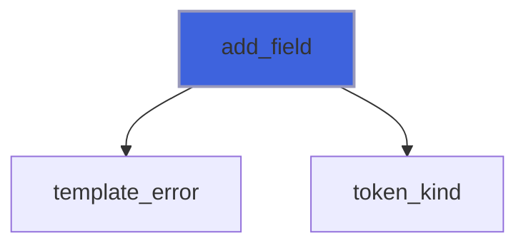

### add_token

```fortran
subroutine add_token(self, kind, style, decorated, name)
```

**Arguments**

| Name | Type | Intent | Attributes | Description |
|------|------|--------|------------|-------------|
| `self` | class([bar_object](/api/src/lib/forbear_bar_object#bar-object)) | inout |  |  |
| `kind` | integer(kind=I4P) | in |  |  |
| `style` | type([element_object](/api/src/lib/forbear_element_object#element-object)) | in | optional |  |
| `decorated` | logical | in | optional |  |
| `name` | character(len=*) | in | optional |  |

**Call graph**

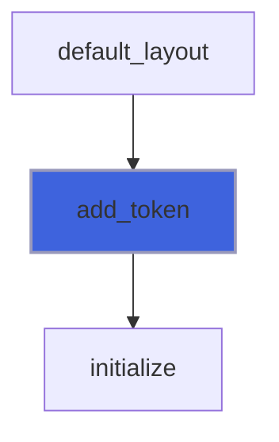

### default_layout

```fortran
subroutine default_layout(self)
```

**Arguments**

| Name | Type | Intent | Attributes | Description |
|------|------|--------|------------|-------------|
| `self` | class([bar_object](/api/src/lib/forbear_bar_object#bar-object)) | inout |  |  |

**Call graph**

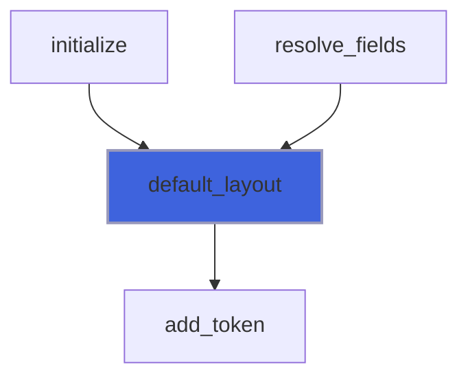

### parse_template

```fortran
subroutine parse_template(self, template)
```

**Arguments**

| Name | Type | Intent | Attributes | Description |
|------|------|--------|------------|-------------|
| `self` | class([bar_object](/api/src/lib/forbear_bar_object#bar-object)) | inout |  |  |
| `template` | character(len=*) | in |  |  |

**Call graph**

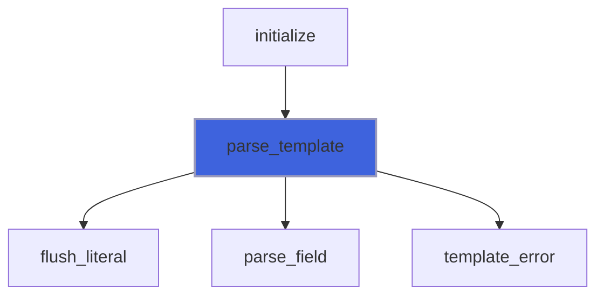

### parse_zones

```fortran
subroutine parse_zones(self, zones)
```

**Arguments**

| Name | Type | Intent | Attributes | Description |
|------|------|--------|------------|-------------|
| `self` | class([bar_object](/api/src/lib/forbear_bar_object#bar-object)) | inout |  |  |
| `zones` | character(len=*) | in |  |  |

**Call graph**

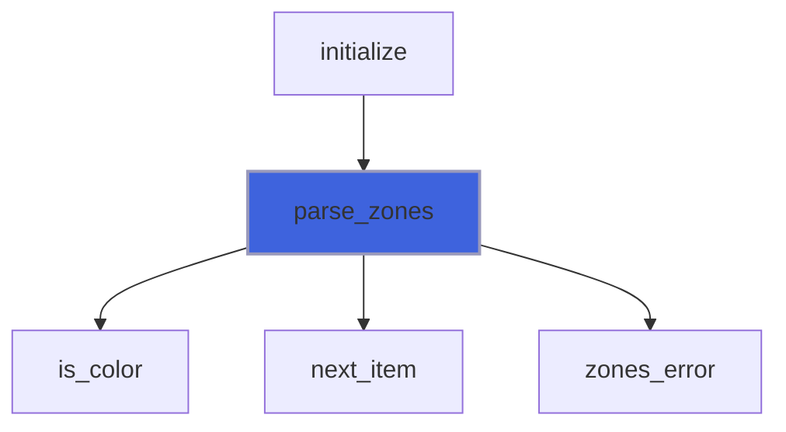

### parse_trail

```fortran
subroutine parse_trail(self, trail)
```

**Arguments**

| Name | Type | Intent | Attributes | Description |
|------|------|--------|------------|-------------|
| `self` | class([bar_object](/api/src/lib/forbear_bar_object#bar-object)) | inout |  |  |
| `trail` | character(len=*) | in |  |  |

**Call graph**

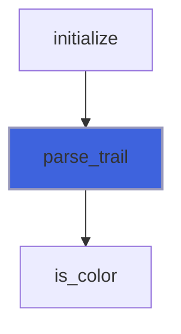

### resolve_fields

```fortran
subroutine resolve_fields(self)
```

**Arguments**

| Name | Type | Intent | Attributes | Description |
|------|------|--------|------------|-------------|
| `self` | class([bar_object](/api/src/lib/forbear_bar_object#bar-object)) | inout |  |  |

**Call graph**

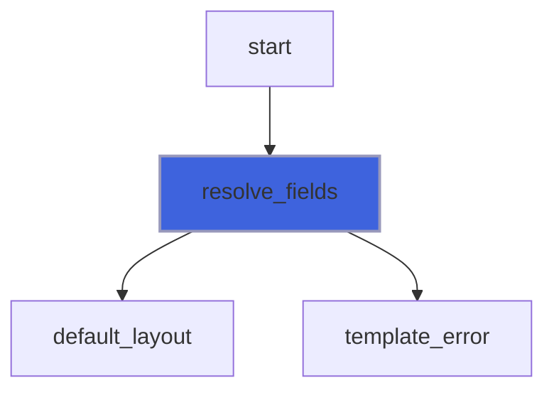

### complete

```fortran
subroutine complete(self, tic, count_rate)
```

**Arguments**

| Name | Type | Intent | Attributes | Description |
|------|------|--------|------------|-------------|
| `self` | class([bar_object](/api/src/lib/forbear_bar_object#bar-object)) | inout |  |  |
| `tic` | integer(kind=I8P) | in |  |  |
| `count_rate` | integer(kind=I8P) | in |  |  |

**Call graph**

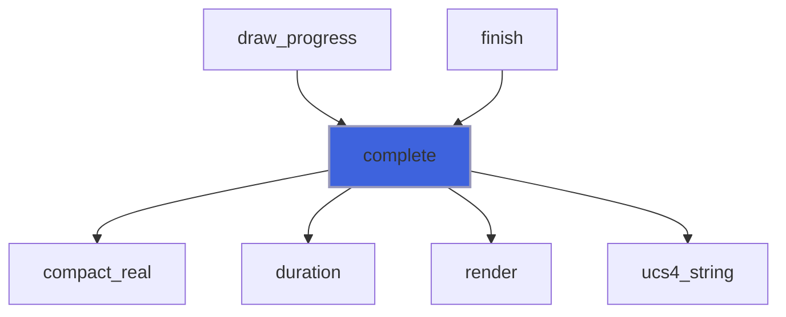

### draw

```fortran
subroutine draw(self)
```

**Arguments**

| Name | Type | Intent | Attributes | Description |
|------|------|--------|------------|-------------|
| `self` | class([bar_object](/api/src/lib/forbear_bar_object#bar-object)) | inout |  |  |

**Call graph**

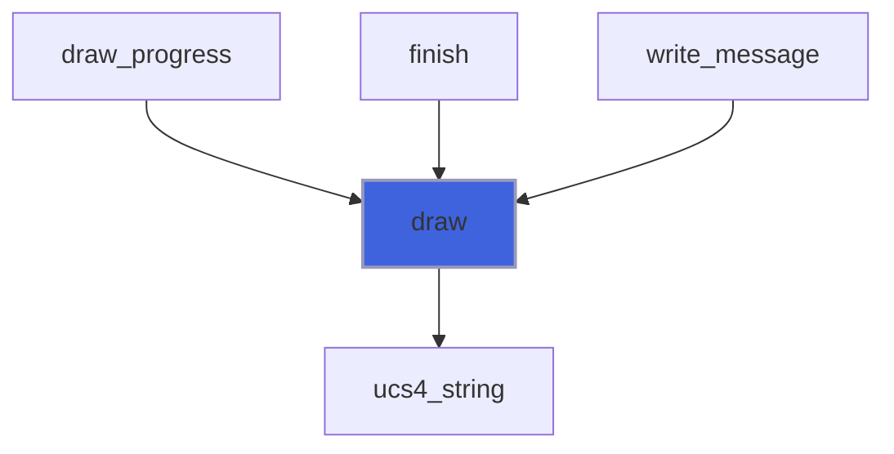

### update_rate

```fortran
subroutine update_rate(self, fraction, tic, count_rate)
```

**Arguments**

| Name | Type | Intent | Attributes | Description |
|------|------|--------|------------|-------------|
| `self` | class([bar_object](/api/src/lib/forbear_bar_object#bar-object)) | inout |  |  |
| `fraction` | real(kind=R8P) | in |  |  |
| `tic` | integer(kind=I8P) | in |  |  |
| `count_rate` | integer(kind=I8P) | in |  |  |

**Call graph**

```mermaid
flowchart TD
  draw_progress["draw_progress"] --> update_rate["update_rate"]
  finish["finish"] --> update_rate["update_rate"]
  style update_rate fill:#3e63dd,stroke:#99b,stroke-width:2px
```

### create_spinner

```fortran
subroutine create_spinner(self, string, color_fg, color_bg, style)
```

**Arguments**

| Name | Type | Intent | Attributes | Description |
|------|------|--------|------------|-------------|
| `self` | class([bar_object](/api/src/lib/forbear_bar_object#bar-object)) | inout |  |  |
| `string` | class(*) | in | optional |  |
| `color_fg` | character(len=*) | in | optional |  |
| `color_bg` | character(len=*) | in | optional |  |
| `style` | character(len=*) | in | optional |  |

**Call graph**

```mermaid
flowchart TD
  initialize["initialize"] --> create_spinner["create_spinner"]
  create_spinner["create_spinner"] --> initialize["initialize"]
  create_spinner["create_spinner"] --> ucs4_string["ucs4_string"]
  style create_spinner fill:#3e63dd,stroke:#99b,stroke-width:2px
```

### template_error

```fortran
subroutine template_error(what, template)
```

**Arguments**

| Name | Type | Intent | Attributes | Description |
|------|------|--------|------------|-------------|
| `what` | character(len=*) | in |  |  |
| `template` | character(len=*) | in |  |  |

**Call graph**

```mermaid
flowchart TD
  add_field["add_field"] --> template_error["template_error"]
  parse_template["parse_template"] --> template_error["template_error"]
  resolve_fields["resolve_fields"] --> template_error["template_error"]
  style template_error fill:#3e63dd,stroke:#99b,stroke-width:2px
```

### zones_error

```fortran
subroutine zones_error(what, zones)
```

**Arguments**

| Name | Type | Intent | Attributes | Description |
|------|------|--------|------------|-------------|
| `what` | character(len=*) | in |  |  |
| `zones` | character(len=*) | in |  |  |

**Call graph**

```mermaid
flowchart TD
  parse_zones["parse_zones"] --> zones_error["zones_error"]
  style zones_error fill:#3e63dd,stroke:#99b,stroke-width:2px
```

## Functions

### is_stdout_locked

**Attributes**: pure

**Returns**: `logical`

```fortran
function is_stdout_locked(self) result(is_locked)
```

**Arguments**

| Name | Type | Intent | Attributes | Description |
|------|------|--------|------------|-------------|
| `self` | class([bar_object](/api/src/lib/forbear_bar_object#bar-object)) | in |  |  |

### bar_body

**Returns**: character(kind=[UCS4](/api/src/lib/forbear_kinds), len=:)

```fortran
function bar_body(self, progress, fraction, plain) result(body)
```

**Arguments**

| Name | Type | Intent | Attributes | Description |
|------|------|--------|------------|-------------|
| `self` | class([bar_object](/api/src/lib/forbear_bar_object#bar-object)) | in |  |  |
| `progress` | integer(kind=I4P) | in |  |  |
| `fraction` | real(kind=R8P) | in |  |  |
| `plain` | logical | in |  |  |

**Call graph**

```mermaid
flowchart TD
  build_frame["build_frame"] --> bar_body["bar_body"]
  bar_body["bar_body"] --> cell_zone["cell_zone"]
  bar_body["bar_body"] --> lit_cells["lit_cells"]
  bar_body["bar_body"] --> pulse_phase["pulse_phase"]
  bar_body["bar_body"] --> render["render"]
  bar_body["bar_body"] --> scanner_body["scanner_body"]
  bar_body["bar_body"] --> ucs4_string["ucs4_string"]
  bar_body["bar_body"] --> unlit_cells["unlit_cells"]
  style bar_body fill:#3e63dd,stroke:#99b,stroke-width:2px
```

### cell_zone

**Attributes**: pure

**Returns**: `integer(kind=I4P)`

```fortran
function cell_zone(self, cell) result(zone)
```

**Arguments**

| Name | Type | Intent | Attributes | Description |
|------|------|--------|------------|-------------|
| `self` | class([bar_object](/api/src/lib/forbear_bar_object#bar-object)) | in |  |  |
| `cell` | integer(kind=I4P) | in |  |  |

**Call graph**

```mermaid
flowchart TD
  bar_body["bar_body"] --> cell_zone["cell_zone"]
  lit_cells["lit_cells"] --> cell_zone["cell_zone"]
  style cell_zone fill:#3e63dd,stroke:#99b,stroke-width:2px
```

### lit_cells

**Attributes**: pure

**Returns**: character(kind=[UCS4](/api/src/lib/forbear_kinds), len=:)

```fortran
function lit_cells(self, first, last, plain) result(cells)
```

**Arguments**

| Name | Type | Intent | Attributes | Description |
|------|------|--------|------------|-------------|
| `self` | class([bar_object](/api/src/lib/forbear_bar_object#bar-object)) | in |  |  |
| `first` | integer(kind=I4P) | in |  |  |
| `last` | integer(kind=I4P) | in |  |  |
| `plain` | logical | in |  |  |

**Call graph**

```mermaid
flowchart TD
  bar_body["bar_body"] --> lit_cells["lit_cells"]
  scanner_body["scanner_body"] --> lit_cells["lit_cells"]
  lit_cells["lit_cells"] --> cell_zone["cell_zone"]
  lit_cells["lit_cells"] --> ramp_level["ramp_level"]
  lit_cells["lit_cells"] --> render["render"]
  lit_cells["lit_cells"] --> ucs4_string["ucs4_string"]
  style lit_cells fill:#3e63dd,stroke:#99b,stroke-width:2px
```

### scanner_body

**Attributes**: pure

**Returns**: character(kind=[UCS4](/api/src/lib/forbear_kinds), len=:)

```fortran
function scanner_body(self, plain) result(body)
```

**Arguments**

| Name | Type | Intent | Attributes | Description |
|------|------|--------|------------|-------------|
| `self` | class([bar_object](/api/src/lib/forbear_bar_object#bar-object)) | in |  |  |
| `plain` | logical | in |  |  |

**Call graph**

```mermaid
flowchart TD
  bar_body["bar_body"] --> scanner_body["scanner_body"]
  scanner_body["scanner_body"] --> lit_cells["lit_cells"]
  scanner_body["scanner_body"] --> pulse_phase["pulse_phase"]
  scanner_body["scanner_body"] --> ramp_level["ramp_level"]
  scanner_body["scanner_body"] --> render["render"]
  scanner_body["scanner_body"] --> ucs4_string["ucs4_string"]
  scanner_body["scanner_body"] --> unlit_cells["unlit_cells"]
  style scanner_body fill:#3e63dd,stroke:#99b,stroke-width:2px
```

### unlit_cells

**Attributes**: pure

**Returns**: character(kind=[UCS4](/api/src/lib/forbear_kinds), len=:)

```fortran
function unlit_cells(self, first, last, plain) result(cells)
```

**Arguments**

| Name | Type | Intent | Attributes | Description |
|------|------|--------|------------|-------------|
| `self` | class([bar_object](/api/src/lib/forbear_bar_object#bar-object)) | in |  |  |
| `first` | integer(kind=I4P) | in |  |  |
| `last` | integer(kind=I4P) | in |  |  |
| `plain` | logical | in |  |  |

**Call graph**

```mermaid
flowchart TD
  bar_body["bar_body"] --> unlit_cells["unlit_cells"]
  scanner_body["scanner_body"] --> unlit_cells["unlit_cells"]
  unlit_cells["unlit_cells"] --> ramp_level["ramp_level"]
  unlit_cells["unlit_cells"] --> render["render"]
  unlit_cells["unlit_cells"] --> ucs4_string["ucs4_string"]
  style unlit_cells fill:#3e63dd,stroke:#99b,stroke-width:2px
```

### progress_state

**Returns**: type([progress_object](/api/src/lib/forbear_field_object#progress-object))

```fortran
function progress_state(self, fraction, progress, elapsed) result(state)
```

**Arguments**

| Name | Type | Intent | Attributes | Description |
|------|------|--------|------------|-------------|
| `self` | class([bar_object](/api/src/lib/forbear_bar_object#bar-object)) | in |  |  |
| `fraction` | real(kind=R8P) | in |  |  |
| `progress` | integer(kind=I4P) | in |  |  |
| `elapsed` | real(kind=R8P) | in |  |  |

**Call graph**

```mermaid
flowchart TD
  build_frame["build_frame"] --> progress_state["progress_state"]
  style progress_state fill:#3e63dd,stroke:#99b,stroke-width:2px
```

### width_before_bar

**Returns**: `integer(kind=I4P)`

```fortran
function width_before_bar(self) result(width)
```

**Arguments**

| Name | Type | Intent | Attributes | Description |
|------|------|--------|------------|-------------|
| `self` | class([bar_object](/api/src/lib/forbear_bar_object#bar-object)) | in |  |  |

**Call graph**

```mermaid
flowchart TD
  width_before_bar["width_before_bar"] --> count_text["count_text"]
  width_before_bar["width_before_bar"] --> display_width["display_width"]
  width_before_bar["width_before_bar"] --> render["render"]
  style width_before_bar fill:#3e63dd,stroke:#99b,stroke-width:2px
```

### compact_real

**Attributes**: pure

**Returns**: `character(len=w)`

```fortran
function compact_real(x, w) result(compact)
```

**Arguments**

| Name | Type | Intent | Attributes | Description |
|------|------|--------|------------|-------------|
| `x` | real(kind=R8P) | in |  |  |
| `w` | integer(kind=I4P) | in |  |  |

**Call graph**

```mermaid
flowchart TD
  build_frame["build_frame"] --> compact_real["compact_real"]
  complete["complete"] --> compact_real["compact_real"]
  count_text["count_text"] --> compact_real["compact_real"]
  done_text["done_text"] --> compact_real["compact_real"]
  duration["duration"] --> compact_real["compact_real"]
  hms["hms"] --> compact_real["compact_real"]
  style compact_real fill:#3e63dd,stroke:#99b,stroke-width:2px
```

### count_text

**Attributes**: pure

**Returns**: `character(len=:)`

```fortran
function count_text(min_value, max_value, fraction) result(text)
```

**Arguments**

| Name | Type | Intent | Attributes | Description |
|------|------|--------|------------|-------------|
| `min_value` | real(kind=R8P) | in |  |  |
| `max_value` | real(kind=R8P) | in |  |  |
| `fraction` | real(kind=R8P) | in |  |  |

**Call graph**

```mermaid
flowchart TD
  build_frame["build_frame"] --> count_text["count_text"]
  width_before_bar["width_before_bar"] --> count_text["count_text"]
  count_text["count_text"] --> compact_real["compact_real"]
  style count_text fill:#3e63dd,stroke:#99b,stroke-width:2px
```

### done_text

**Attributes**: pure

**Returns**: `character(len=:)`

```fortran
function done_text(min_value, done) result(text)
```

**Arguments**

| Name | Type | Intent | Attributes | Description |
|------|------|--------|------------|-------------|
| `min_value` | real(kind=R8P) | in |  |  |
| `done` | real(kind=R8P) | in |  |  |

**Call graph**

```mermaid
flowchart TD
  build_frame["build_frame"] --> done_text["done_text"]
  done_text["done_text"] --> compact_real["compact_real"]
  style done_text fill:#3e63dd,stroke:#99b,stroke-width:2px
```

### pulse_phase

**Attributes**: pure

**Returns**: `integer(kind=I4P)`

```fortran
function pulse_phase(drawing, travel) result(phase)
```

**Arguments**

| Name | Type | Intent | Attributes | Description |
|------|------|--------|------------|-------------|
| `drawing` | integer(kind=I4P) | in |  |  |
| `travel` | integer(kind=I4P) | in |  |  |

**Call graph**

```mermaid
flowchart TD
  bar_body["bar_body"] --> pulse_phase["pulse_phase"]
  scanner_body["scanner_body"] --> pulse_phase["pulse_phase"]
  style pulse_phase fill:#3e63dd,stroke:#99b,stroke-width:2px
```

### ramp_level

**Attributes**: pure

**Returns**: `integer(kind=I4P)`

```fortran
function ramp_level(cell, width) result(level)
```

**Arguments**

| Name | Type | Intent | Attributes | Description |
|------|------|--------|------------|-------------|
| `cell` | integer(kind=I4P) | in |  |  |
| `width` | integer(kind=I4P) | in |  |  |

**Call graph**

```mermaid
flowchart TD
  lit_cells["lit_cells"] --> ramp_level["ramp_level"]
  scanner_body["scanner_body"] --> ramp_level["ramp_level"]
  unlit_cells["unlit_cells"] --> ramp_level["ramp_level"]
  style ramp_level fill:#3e63dd,stroke:#99b,stroke-width:2px
```

### display_width

**Attributes**: pure

**Returns**: `integer(kind=I4P)`

```fortran
function display_width(string) result(width)
```

**Arguments**

| Name | Type | Intent | Attributes | Description |
|------|------|--------|------------|-------------|
| `string` | character(kind=[UCS4](/api/src/lib/forbear_kinds), len=*) | in |  |  |

**Call graph**

```mermaid
flowchart TD
  width_before_bar["width_before_bar"] --> display_width["display_width"]
  style display_width fill:#3e63dd,stroke:#99b,stroke-width:2px
```

### styled

**Returns**: character(kind=[UCS4](/api/src/lib/forbear_kinds), len=:)

```fortran
function styled(token, text, plain) result(output)
```

**Arguments**

| Name | Type | Intent | Attributes | Description |
|------|------|--------|------------|-------------|
| `token` | type([token_object](/api/src/lib/forbear_bar_object#token-object)) | inout |  |  |
| `text` | character(len=*) | in |  |  |
| `plain` | logical | in |  |  |

**Call graph**

```mermaid
flowchart TD
  build_frame["build_frame"] --> styled["styled"]
  styled["styled"] --> render["render"]
  styled["styled"] --> ucs4_string["ucs4_string"]
  style styled fill:#3e63dd,stroke:#99b,stroke-width:2px
```

### token_kind

**Attributes**: pure

**Returns**: `integer(kind=I4P)`

```fortran
function token_kind(name) result(kind)
```

**Arguments**

| Name | Type | Intent | Attributes | Description |
|------|------|--------|------------|-------------|
| `name` | character(len=*) | in |  |  |

**Call graph**

```mermaid
flowchart TD
  add_field["add_field"] --> token_kind["token_kind"]
  style token_kind fill:#3e63dd,stroke:#99b,stroke-width:2px
```

### duration

**Attributes**: pure

**Returns**: `character(len=:)`

```fortran
function duration(seconds) result(text)
```

**Arguments**

| Name | Type | Intent | Attributes | Description |
|------|------|--------|------------|-------------|
| `seconds` | real(kind=R8P) | in |  |  |

**Call graph**

```mermaid
flowchart TD
  complete["complete"] --> duration["duration"]
  duration["duration"] --> compact_real["compact_real"]
  duration["duration"] --> hms["hms"]
  style duration fill:#3e63dd,stroke:#99b,stroke-width:2px
```

### get_environment

**Returns**: `logical`

```fortran
function get_environment(name, value) result(is_set)
```

**Arguments**

| Name | Type | Intent | Attributes | Description |
|------|------|--------|------------|-------------|
| `name` | character(len=*) | in |  |  |
| `value` | character(len=:) | out | allocatable |  |

**Call graph**

```mermaid
flowchart TD
  initialize["initialize"] --> get_environment["get_environment"]
  style get_environment fill:#3e63dd,stroke:#99b,stroke-width:2px
```

### hms

**Attributes**: pure

**Returns**: `character(len=8)`

```fortran
function hms(seconds) result(text)
```

**Arguments**

| Name | Type | Intent | Attributes | Description |
|------|------|--------|------------|-------------|
| `seconds` | real(kind=R8P) | in |  |  |

**Call graph**

```mermaid
flowchart TD
  build_frame["build_frame"] --> hms["hms"]
  duration["duration"] --> hms["hms"]
  hms["hms"] --> compact_real["compact_real"]
  style hms fill:#3e63dd,stroke:#99b,stroke-width:2px
```

### is_terminal

**Returns**: `logical`

```fortran
function is_terminal(unit)
```

**Arguments**

| Name | Type | Intent | Attributes | Description |
|------|------|--------|------------|-------------|
| `unit` | integer(kind=I4P) | in |  |  |

**Call graph**

```mermaid
flowchart TD
  initialize["initialize"] --> is_terminal["is_terminal"]
  style is_terminal fill:#3e63dd,stroke:#99b,stroke-width:2px
```

### render

**Attributes**: pure

**Returns**: character(kind=[UCS4](/api/src/lib/forbear_kinds), len=:)

```fortran
function render(element, plain) result(text)
```

**Arguments**

| Name | Type | Intent | Attributes | Description |
|------|------|--------|------------|-------------|
| `element` | type([element_object](/api/src/lib/forbear_element_object#element-object)) | in |  |  |
| `plain` | logical | in |  |  |

**Call graph**

```mermaid
flowchart TD
  bar_body["bar_body"] --> render["render"]
  build_frame["build_frame"] --> render["render"]
  complete["complete"] --> render["render"]
  lit_cells["lit_cells"] --> render["render"]
  scanner_body["scanner_body"] --> render["render"]
  styled["styled"] --> render["render"]
  unlit_cells["unlit_cells"] --> render["render"]
  width_before_bar["width_before_bar"] --> render["render"]
  render["render"] --> output["output"]
  style render fill:#3e63dd,stroke:#99b,stroke-width:2px
```
