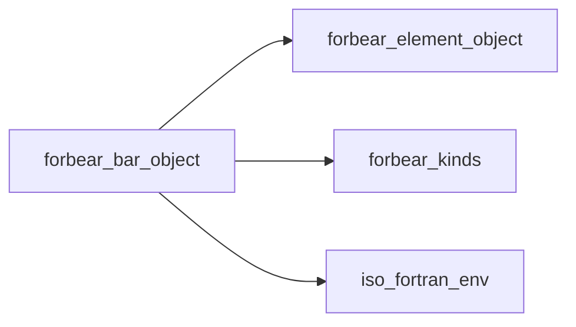
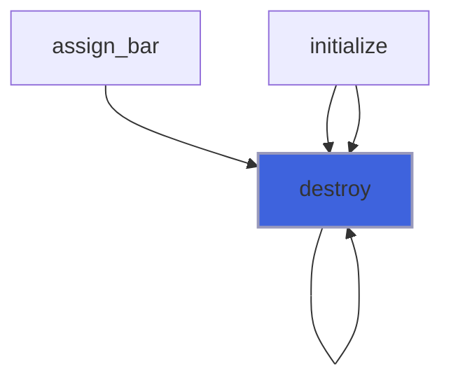
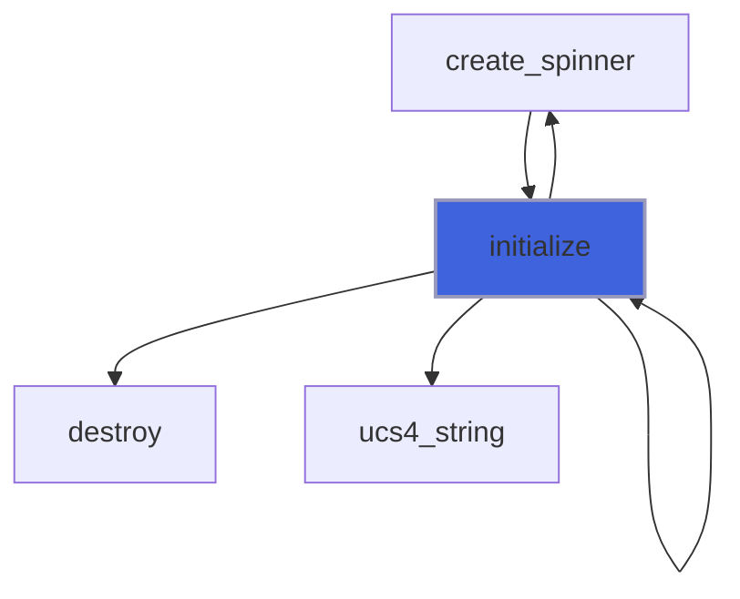
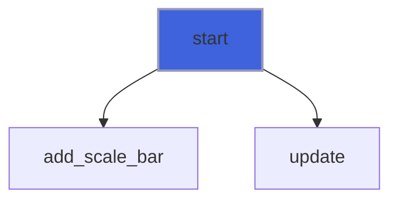
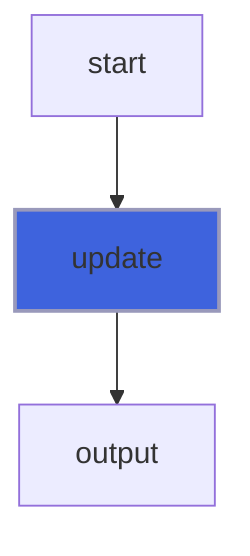
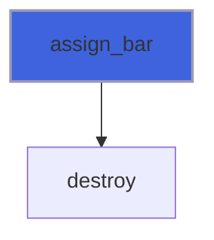
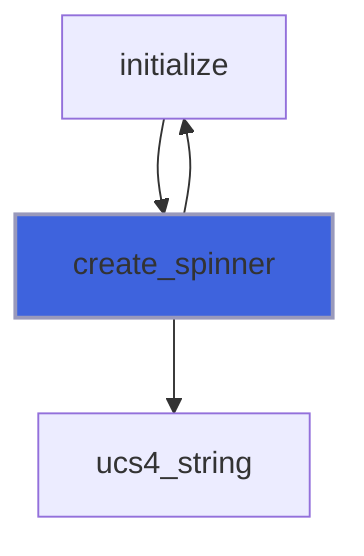

# forbear_bar_object

**Source**: `src/lib/forbear_bar_object.F90`

**Dependencies**



## Contents

- [bar_object](#bar-object)
- [destroy](#destroy)
- [initialize](#initialize)
- [start](#start)
- [update](#update)
- [assign_bar](#assign-bar)
- [create_spinner](#create-spinner)
- [is_stdout_locked](#is-stdout-locked)

## Derived Types

### bar_object

#### Components

| Name | Type | Attributes | Description |
|------|------|------------|-------------|
| `prefix` | type([element_object](/api/src/lib/forbear_element_object#element-object)) |  |  |
| `suffix` | type([element_object](/api/src/lib/forbear_element_object#element-object)) |  |  |
| `bracket_left` | type([element_object](/api/src/lib/forbear_element_object#element-object)) |  |  |
| `bracket_right` | type([element_object](/api/src/lib/forbear_element_object#element-object)) |  |  |
| `empty_char` | type([element_object](/api/src/lib/forbear_element_object#element-object)) |  |  |
| `filled_char` | type([element_object](/api/src/lib/forbear_element_object#element-object)) |  |  |
| `progress_percent` | type([element_object](/api/src/lib/forbear_element_object#element-object)) |  |  |
| `progress_speed` | type([element_object](/api/src/lib/forbear_element_object#element-object)) |  |  |
| `scale_bar` | type([element_object](/api/src/lib/forbear_element_object#element-object)) |  |  |
| `date_time` | type([element_object](/api/src/lib/forbear_element_object#element-object)) |  |  |
| `spinner` | type([element_object](/api/src/lib/forbear_element_object#element-object)) | allocatable |  |
| `width` | integer(kind=I4P) |  |  |
| `min_value` | real(kind=R8P) |  |  |
| `max_value` | real(kind=R8P) |  |  |
| `frequency` | integer(kind=I4P) |  |  |
| `add_scale_bar` | logical |  |  |
| `add_progress_percent` | logical |  |  |
| `add_progress_speed` | logical |  |  |
| `add_date_time` | logical |  |  |
| `is_stdout_locked_` | logical |  |  |
| `output_unit` | integer(kind=I4P) |  |  |

#### Type-Bound Procedures

| Name | Attributes | Description |
|------|------------|-------------|
| `destroy` | pass(self) |  |
| `initialize` | pass(self) |  |
| `is_stdout_locked` | pass(self) |  |
| `start` | pass(self) |  |
| `update` | pass(self) |  |
| `assignment(=)` |  |  |
| `assign_bar` | pass(lhs) |  |
| `create_spinner` | pass(self) |  |

## Subroutines

### destroy

**Attributes**: pure

```fortran
subroutine destroy(self)
```

**Arguments**

| Name | Type | Intent | Attributes | Description |
|------|------|--------|------------|-------------|
| `self` | class([bar_object](/api/src/lib/forbear_bar_object#bar-object)) | inout |  |  |

**Call graph**



### initialize

```fortran
subroutine initialize(self, prefix_string, prefix_color_fg, prefix_color_bg, prefix_style, suffix_string, suffix_color_fg, suffix_color_bg, suffix_style, bracket_left_string, bracket_left_color_fg, bracket_left_color_bg, bracket_left_style, bracket_right_string, bracket_right_color_fg, bracket_right_color_bg, bracket_right_style, empty_char_string, empty_char_color_fg, empty_char_color_bg, empty_char_style, filled_char_string, filled_char_color_fg, filled_char_color_bg, filled_char_style, spinner_string, spinner_color_fg, spinner_color_bg, spinner_style, add_scale_bar, scale_bar_color_fg, scale_bar_color_bg, scale_bar_style, add_progress_percent, progress_percent_color_fg, progress_percent_color_bg, progress_percent_style, add_progress_speed, progress_speed_color_fg, progress_speed_color_bg, progress_speed_style, add_date_time, date_time_color_fg, date_time_color_bg, date_time_style, width, min_value, max_value, frequency, output_unit)
```

**Arguments**

| Name | Type | Intent | Attributes | Description |
|------|------|--------|------------|-------------|
| `self` | class([bar_object](/api/src/lib/forbear_bar_object#bar-object)) | inout |  |  |
| `prefix_string` | class(*) | in | optional |  |
| `prefix_color_fg` | character(len=*) | in | optional |  |
| `prefix_color_bg` | character(len=*) | in | optional |  |
| `prefix_style` | character(len=*) | in | optional |  |
| `suffix_string` | class(*) | in | optional |  |
| `suffix_color_fg` | character(len=*) | in | optional |  |
| `suffix_color_bg` | character(len=*) | in | optional |  |
| `suffix_style` | character(len=*) | in | optional |  |
| `bracket_left_string` | class(*) | in | optional |  |
| `bracket_left_color_fg` | character(len=*) | in | optional |  |
| `bracket_left_color_bg` | character(len=*) | in | optional |  |
| `bracket_left_style` | character(len=*) | in | optional |  |
| `bracket_right_string` | class(*) | in | optional |  |
| `bracket_right_color_fg` | character(len=*) | in | optional |  |
| `bracket_right_color_bg` | character(len=*) | in | optional |  |
| `bracket_right_style` | character(len=*) | in | optional |  |
| `empty_char_string` | class(*) | in | optional |  |
| `empty_char_color_fg` | character(len=*) | in | optional |  |
| `empty_char_color_bg` | character(len=*) | in | optional |  |
| `empty_char_style` | character(len=*) | in | optional |  |
| `filled_char_string` | class(*) | in | optional |  |
| `filled_char_color_fg` | character(len=*) | in | optional |  |
| `filled_char_color_bg` | character(len=*) | in | optional |  |
| `filled_char_style` | character(len=*) | in | optional |  |
| `spinner_string` | class(*) | in | optional |  |
| `spinner_color_fg` | character(len=*) | in | optional |  |
| `spinner_color_bg` | character(len=*) | in | optional |  |
| `spinner_style` | character(len=*) | in | optional |  |
| `add_scale_bar` | logical | in | optional |  |
| `scale_bar_color_fg` | character(len=*) | in | optional |  |
| `scale_bar_color_bg` | character(len=*) | in | optional |  |
| `scale_bar_style` | character(len=*) | in | optional |  |
| `add_progress_percent` | logical | in | optional |  |
| `progress_percent_color_fg` | character(len=*) | in | optional |  |
| `progress_percent_color_bg` | character(len=*) | in | optional |  |
| `progress_percent_style` | character(len=*) | in | optional |  |
| `add_progress_speed` | logical | in | optional |  |
| `progress_speed_color_fg` | character(len=*) | in | optional |  |
| `progress_speed_color_bg` | character(len=*) | in | optional |  |
| `progress_speed_style` | character(len=*) | in | optional |  |
| `add_date_time` | logical | in | optional |  |
| `date_time_color_fg` | character(len=*) | in | optional |  |
| `date_time_color_bg` | character(len=*) | in | optional |  |
| `date_time_style` | character(len=*) | in | optional |  |
| `width` | integer(kind=I4P) | in | optional |  |
| `min_value` | real(kind=R8P) | in | optional |  |
| `max_value` | real(kind=R8P) | in | optional |  |
| `frequency` | integer(kind=I4P) | in | optional |  |
| `output_unit` | integer(kind=I4P) | in | optional |  |

**Call graph**



### start

```fortran
subroutine start(self)
```

**Arguments**

| Name | Type | Intent | Attributes | Description |
|------|------|--------|------------|-------------|
| `self` | class([bar_object](/api/src/lib/forbear_bar_object#bar-object)) | inout |  |  |

**Call graph**



### update

```fortran
subroutine update(self, current)
```

**Arguments**

| Name | Type | Intent | Attributes | Description |
|------|------|--------|------------|-------------|
| `self` | class([bar_object](/api/src/lib/forbear_bar_object#bar-object)) | inout |  |  |
| `current` | real(kind=R8P) | in |  |  |

**Call graph**



### assign_bar

**Attributes**: pure

```fortran
subroutine assign_bar(lhs, rhs)
```

**Arguments**

| Name | Type | Intent | Attributes | Description |
|------|------|--------|------------|-------------|
| `lhs` | class([bar_object](/api/src/lib/forbear_bar_object#bar-object)) | inout |  |  |
| `rhs` | type([bar_object](/api/src/lib/forbear_bar_object#bar-object)) | in |  |  |

**Call graph**



### create_spinner

```fortran
subroutine create_spinner(self, string, color_fg, color_bg, style)
```

**Arguments**

| Name | Type | Intent | Attributes | Description |
|------|------|--------|------------|-------------|
| `self` | class([bar_object](/api/src/lib/forbear_bar_object#bar-object)) | inout |  |  |
| `string` | class(*) | in | optional |  |
| `color_fg` | character(len=*) | in | optional |  |
| `color_bg` | character(len=*) | in | optional |  |
| `style` | character(len=*) | in | optional |  |

**Call graph**



## Functions

### is_stdout_locked

**Attributes**: pure

**Returns**: `logical`

```fortran
function is_stdout_locked(self) result(is_locked)
```

**Arguments**

| Name | Type | Intent | Attributes | Description |
|------|------|--------|------------|-------------|
| `self` | class([bar_object](/api/src/lib/forbear_bar_object#bar-object)) | in |  |  |
