# forbear_bar_object

**Source**: `src/lib/forbear_bar_object.F90`

**Dependencies**

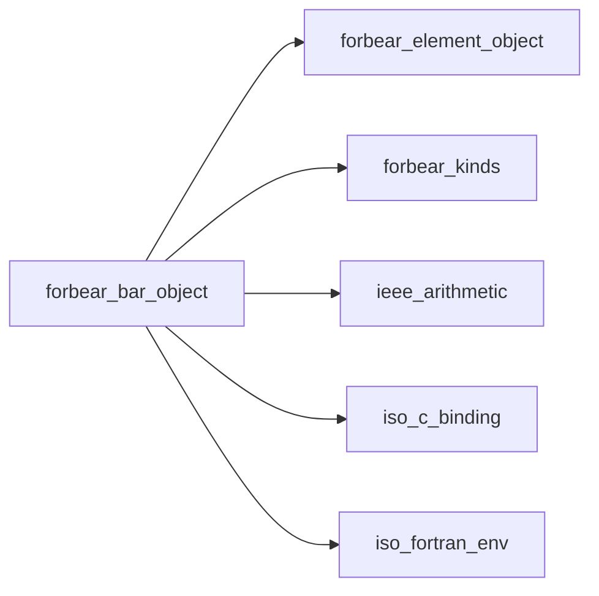

## Contents

- [bar_object](#bar-object)
- [isatty](#isatty)
- [destroy](#destroy)
- [initialize](#initialize)
- [start](#start)
- [update](#update)
- [write_message](#write-message)
- [build_frame](#build-frame)
- [complete](#complete)
- [draw](#draw)
- [update_rate](#update-rate)
- [create_spinner](#create-spinner)
- [is_stdout_locked](#is-stdout-locked)
- [compact_real](#compact-real)
- [count_text](#count-text)
- [duration](#duration)
- [get_environment](#get-environment)
- [hms](#hms)
- [is_terminal](#is-terminal)
- [render](#render)

## Variables

| Name | Type | Attributes | Description |
|------|------|------------|-------------|
| `ESC` | character(len=1) | parameter |  |
| `CR` | character(len=1) | parameter |  |
| `LF` | character(len=1) | parameter |  |
| `FULL_BLOCK` | character(len=*) | parameter |  |
| `PARTIAL_BLOCKS` | character(len=*) | parameter |  |

## Derived Types

### bar_object

#### Components

| Name | Type | Attributes | Description |
|------|------|------------|-------------|
| `prefix` | type([element_object](/api/src/lib/forbear_element_object#element-object)) |  |  |
| `suffix` | type([element_object](/api/src/lib/forbear_element_object#element-object)) |  |  |
| `bracket_left` | type([element_object](/api/src/lib/forbear_element_object#element-object)) |  |  |
| `bracket_right` | type([element_object](/api/src/lib/forbear_element_object#element-object)) |  |  |
| `empty_char` | type([element_object](/api/src/lib/forbear_element_object#element-object)) |  |  |
| `filled_char` | type([element_object](/api/src/lib/forbear_element_object#element-object)) |  |  |
| `progress_percent` | type([element_object](/api/src/lib/forbear_element_object#element-object)) |  |  |
| `progress_count` | type([element_object](/api/src/lib/forbear_element_object#element-object)) |  |  |
| `progress_speed` | type([element_object](/api/src/lib/forbear_element_object#element-object)) |  |  |
| `eta` | type([element_object](/api/src/lib/forbear_element_object#element-object)) |  |  |
| `message` | type([element_object](/api/src/lib/forbear_element_object#element-object)) |  |  |
| `scale_bar` | type([element_object](/api/src/lib/forbear_element_object#element-object)) |  |  |
| `date_time` | type([element_object](/api/src/lib/forbear_element_object#element-object)) |  |  |
| `summary` | type([element_object](/api/src/lib/forbear_element_object#element-object)) |  |  |
| `spinner` | type([element_object](/api/src/lib/forbear_element_object#element-object)) | allocatable |  |
| `width` | integer(kind=I4P) |  |  |
| `min_value` | real(kind=R8P) |  |  |
| `max_value` | real(kind=R8P) |  |  |
| `frequency` | integer(kind=I4P) |  |  |
| `min_interval` | real(kind=R8P) |  |  |
| `smoothing` | real(kind=R8P) |  |  |
| `position` | integer(kind=I4P) |  |  |
| `add_scale_bar` | logical |  |  |
| `add_progress_percent` | logical |  |  |
| `add_progress_count` | logical |  |  |
| `add_progress_speed` | logical |  |  |
| `add_eta` | logical |  |  |
| `add_date_time` | logical |  |  |
| `add_summary` | logical |  |  |
| `partial_blocks` | logical |  |  |
| `is_interactive_` | logical |  |  |
| `is_disabled_` | logical |  |  |
| `hide_cursor` | logical |  |  |
| `is_stdout_locked_` | logical |  |  |
| `output_unit` | integer(kind=I4P) |  |  |
| `progress_drawn_` | integer(kind=I4P) |  |  |
| `fraction_drawn_` | real(kind=R8P) |  |  |
| `rate_` | real(kind=R8P) |  |  |
| `rate_samples_` | integer(kind=I4P) |  |  |
| `tic_` | integer(kind=I8P) |  |  |
| `tic_start_` | integer(kind=I8P) |  |  |
| `spinner_count_` | integer(kind=I4P) |  |  |
| `date_time_start_` | character(len=18) |  |  |
| `is_complete_` | logical |  |  |
| `frame_` | character(kind=[UCS4](/api/src/third_party/FACE/src/lib/face), len=:) | allocatable |  |

#### Type-Bound Procedures

| Name | Attributes | Description |
|------|------------|-------------|
| `destroy` | pass(self) |  |
| `initialize` | pass(self) |  |
| `is_stdout_locked` | pass(self) |  |
| `start` | pass(self) |  |
| `update` | pass(self) |  |
| `write` | pass(self) |  |
| `build_frame` | pass(self) |  |
| `complete` | pass(self) |  |
| `create_spinner` | pass(self) |  |
| `draw` | pass(self) |  |
| `update_rate` | pass(self) |  |

## Interfaces

### isatty

## Subroutines

### destroy

**Attributes**: pure

```fortran
subroutine destroy(self)
```

**Arguments**

| Name | Type | Intent | Attributes | Description |
|------|------|--------|------------|-------------|
| `self` | class([bar_object](/api/src/lib/forbear_bar_object#bar-object)) | inout |  |  |

**Call graph**

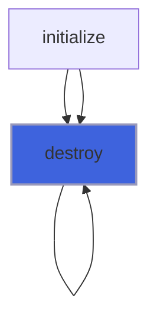

### initialize

```fortran
subroutine initialize(self, prefix_string, prefix_color_fg, prefix_color_bg, prefix_style, suffix_string, suffix_color_fg, suffix_color_bg, suffix_style, bracket_left_string, bracket_left_color_fg, bracket_left_color_bg, bracket_left_style, bracket_right_string, bracket_right_color_fg, bracket_right_color_bg, bracket_right_style, empty_char_string, empty_char_color_fg, empty_char_color_bg, empty_char_style, filled_char_string, filled_char_color_fg, filled_char_color_bg, filled_char_style, spinner_string, spinner_color_fg, spinner_color_bg, spinner_style, add_scale_bar, scale_bar_color_fg, scale_bar_color_bg, scale_bar_style, add_progress_percent, progress_percent_color_fg, progress_percent_color_bg, progress_percent_style, add_progress_count, progress_count_color_fg, progress_count_color_bg, progress_count_style, add_progress_speed, progress_speed_color_fg, progress_speed_color_bg, progress_speed_style, add_eta, eta_color_fg, eta_color_bg, eta_style, add_date_time, date_time_color_fg, date_time_color_bg, date_time_style, add_summary, summary_color_fg, summary_color_bg, summary_style, message_color_fg, message_color_bg, message_style, width, min_value, max_value, frequency, min_interval, smoothing, partial_blocks, position, interactive, disabled, hide_cursor, output_unit)
```

**Arguments**

| Name | Type | Intent | Attributes | Description |
|------|------|--------|------------|-------------|
| `self` | class([bar_object](/api/src/lib/forbear_bar_object#bar-object)) | inout |  |  |
| `prefix_string` | class(*) | in | optional |  |
| `prefix_color_fg` | character(len=*) | in | optional |  |
| `prefix_color_bg` | character(len=*) | in | optional |  |
| `prefix_style` | character(len=*) | in | optional |  |
| `suffix_string` | class(*) | in | optional |  |
| `suffix_color_fg` | character(len=*) | in | optional |  |
| `suffix_color_bg` | character(len=*) | in | optional |  |
| `suffix_style` | character(len=*) | in | optional |  |
| `bracket_left_string` | class(*) | in | optional |  |
| `bracket_left_color_fg` | character(len=*) | in | optional |  |
| `bracket_left_color_bg` | character(len=*) | in | optional |  |
| `bracket_left_style` | character(len=*) | in | optional |  |
| `bracket_right_string` | class(*) | in | optional |  |
| `bracket_right_color_fg` | character(len=*) | in | optional |  |
| `bracket_right_color_bg` | character(len=*) | in | optional |  |
| `bracket_right_style` | character(len=*) | in | optional |  |
| `empty_char_string` | class(*) | in | optional |  |
| `empty_char_color_fg` | character(len=*) | in | optional |  |
| `empty_char_color_bg` | character(len=*) | in | optional |  |
| `empty_char_style` | character(len=*) | in | optional |  |
| `filled_char_string` | class(*) | in | optional |  |
| `filled_char_color_fg` | character(len=*) | in | optional |  |
| `filled_char_color_bg` | character(len=*) | in | optional |  |
| `filled_char_style` | character(len=*) | in | optional |  |
| `spinner_string` | class(*) | in | optional |  |
| `spinner_color_fg` | character(len=*) | in | optional |  |
| `spinner_color_bg` | character(len=*) | in | optional |  |
| `spinner_style` | character(len=*) | in | optional |  |
| `add_scale_bar` | logical | in | optional |  |
| `scale_bar_color_fg` | character(len=*) | in | optional |  |
| `scale_bar_color_bg` | character(len=*) | in | optional |  |
| `scale_bar_style` | character(len=*) | in | optional |  |
| `add_progress_percent` | logical | in | optional |  |
| `progress_percent_color_fg` | character(len=*) | in | optional |  |
| `progress_percent_color_bg` | character(len=*) | in | optional |  |
| `progress_percent_style` | character(len=*) | in | optional |  |
| `add_progress_count` | logical | in | optional |  |
| `progress_count_color_fg` | character(len=*) | in | optional |  |
| `progress_count_color_bg` | character(len=*) | in | optional |  |
| `progress_count_style` | character(len=*) | in | optional |  |
| `add_progress_speed` | logical | in | optional |  |
| `progress_speed_color_fg` | character(len=*) | in | optional |  |
| `progress_speed_color_bg` | character(len=*) | in | optional |  |
| `progress_speed_style` | character(len=*) | in | optional |  |
| `add_eta` | logical | in | optional |  |
| `eta_color_fg` | character(len=*) | in | optional |  |
| `eta_color_bg` | character(len=*) | in | optional |  |
| `eta_style` | character(len=*) | in | optional |  |
| `add_date_time` | logical | in | optional |  |
| `date_time_color_fg` | character(len=*) | in | optional |  |
| `date_time_color_bg` | character(len=*) | in | optional |  |
| `date_time_style` | character(len=*) | in | optional |  |
| `add_summary` | logical | in | optional |  |
| `summary_color_fg` | character(len=*) | in | optional |  |
| `summary_color_bg` | character(len=*) | in | optional |  |
| `summary_style` | character(len=*) | in | optional |  |
| `message_color_fg` | character(len=*) | in | optional |  |
| `message_color_bg` | character(len=*) | in | optional |  |
| `message_style` | character(len=*) | in | optional |  |
| `width` | integer(kind=I4P) | in | optional |  |
| `min_value` | real(kind=R8P) | in | optional |  |
| `max_value` | real(kind=R8P) | in | optional |  |
| `frequency` | integer(kind=I4P) | in | optional |  |
| `min_interval` | real(kind=R8P) | in | optional |  |
| `smoothing` | real(kind=R8P) | in | optional |  |
| `partial_blocks` | logical | in | optional |  |
| `position` | integer(kind=I4P) | in | optional |  |
| `interactive` | logical | in | optional |  |
| `disabled` | logical | in | optional |  |
| `hide_cursor` | logical | in | optional |  |
| `output_unit` | integer(kind=I4P) | in | optional |  |

**Call graph**

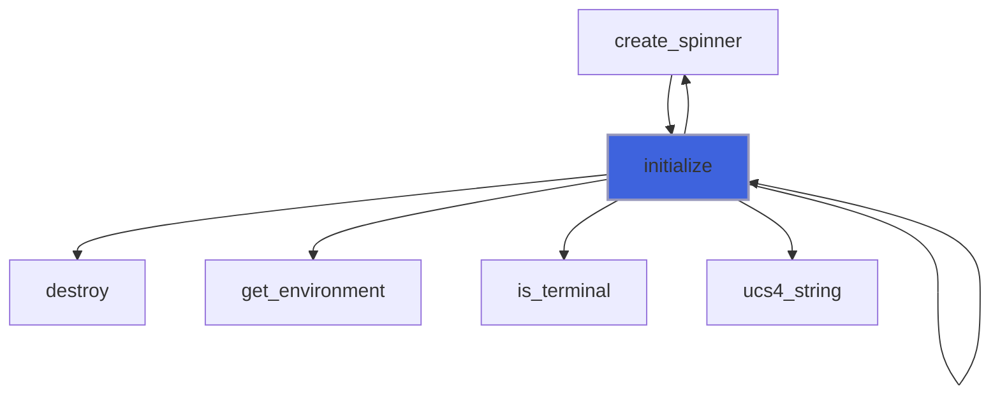

### start

```fortran
subroutine start(self)
```

**Arguments**

| Name | Type | Intent | Attributes | Description |
|------|------|--------|------------|-------------|
| `self` | class([bar_object](/api/src/lib/forbear_bar_object#bar-object)) | inout |  |  |

**Call graph**

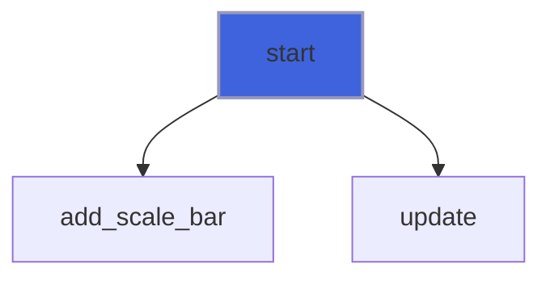

### update

```fortran
subroutine update(self, current, message)
```

**Arguments**

| Name | Type | Intent | Attributes | Description |
|------|------|--------|------------|-------------|
| `self` | class([bar_object](/api/src/lib/forbear_bar_object#bar-object)) | inout |  |  |
| `current` | real(kind=R8P) | in |  |  |
| `message` | class(*) | in | optional |  |

**Call graph**

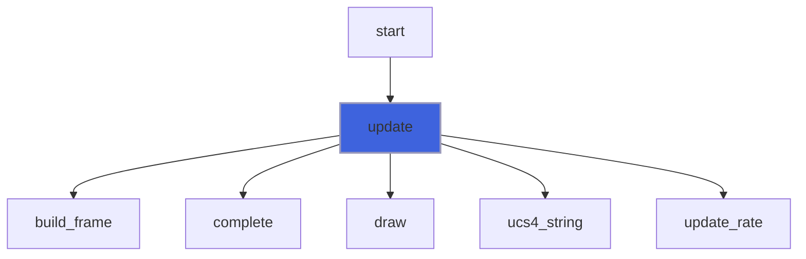

### write_message

```fortran
subroutine write_message(self, message)
```

**Arguments**

| Name | Type | Intent | Attributes | Description |
|------|------|--------|------------|-------------|
| `self` | class([bar_object](/api/src/lib/forbear_bar_object#bar-object)) | inout |  |  |
| `message` | class(*) | in |  |  |

**Call graph**

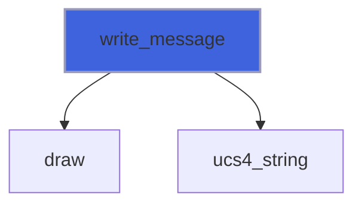

### build_frame

```fortran
subroutine build_frame(self, progress, fraction)
```

**Arguments**

| Name | Type | Intent | Attributes | Description |
|------|------|--------|------------|-------------|
| `self` | class([bar_object](/api/src/lib/forbear_bar_object#bar-object)) | inout |  |  |
| `progress` | integer(kind=I4P) | in |  |  |
| `fraction` | real(kind=R8P) | in |  |  |

**Call graph**

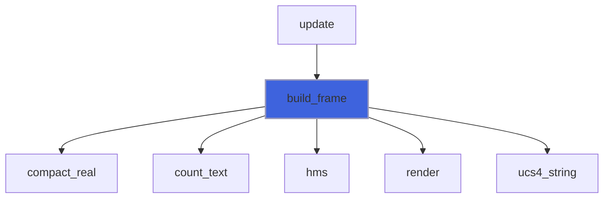

### complete

```fortran
subroutine complete(self, tic, count_rate)
```

**Arguments**

| Name | Type | Intent | Attributes | Description |
|------|------|--------|------------|-------------|
| `self` | class([bar_object](/api/src/lib/forbear_bar_object#bar-object)) | inout |  |  |
| `tic` | integer(kind=I8P) | in |  |  |
| `count_rate` | integer(kind=I8P) | in |  |  |

**Call graph**

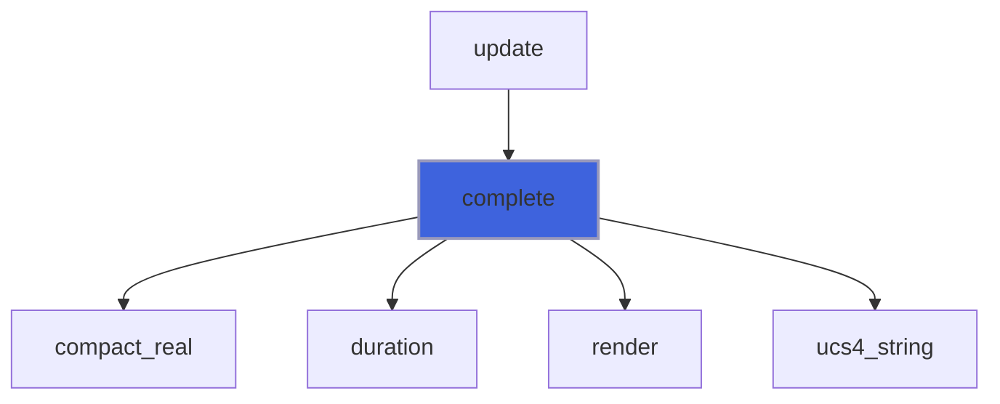

### draw

```fortran
subroutine draw(self)
```

**Arguments**

| Name | Type | Intent | Attributes | Description |
|------|------|--------|------------|-------------|
| `self` | class([bar_object](/api/src/lib/forbear_bar_object#bar-object)) | inout |  |  |

**Call graph**

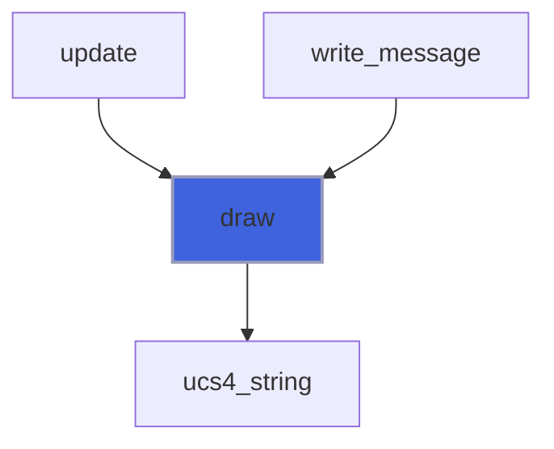

### update_rate

```fortran
subroutine update_rate(self, fraction, tic, count_rate)
```

**Arguments**

| Name | Type | Intent | Attributes | Description |
|------|------|--------|------------|-------------|
| `self` | class([bar_object](/api/src/lib/forbear_bar_object#bar-object)) | inout |  |  |
| `fraction` | real(kind=R8P) | in |  |  |
| `tic` | integer(kind=I8P) | in |  |  |
| `count_rate` | integer(kind=I8P) | in |  |  |

**Call graph**

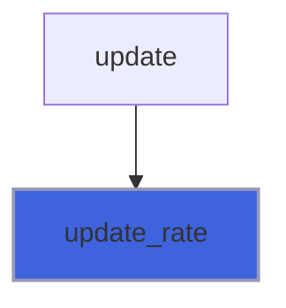

### create_spinner

```fortran
subroutine create_spinner(self, string, color_fg, color_bg, style)
```

**Arguments**

| Name | Type | Intent | Attributes | Description |
|------|------|--------|------------|-------------|
| `self` | class([bar_object](/api/src/lib/forbear_bar_object#bar-object)) | inout |  |  |
| `string` | class(*) | in | optional |  |
| `color_fg` | character(len=*) | in | optional |  |
| `color_bg` | character(len=*) | in | optional |  |
| `style` | character(len=*) | in | optional |  |

**Call graph**

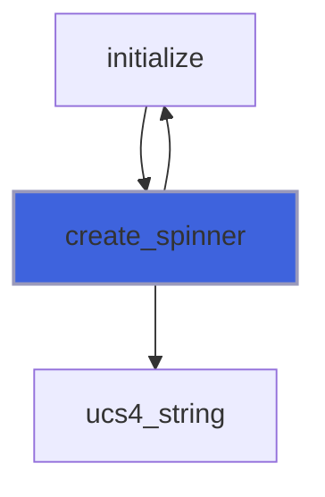

## Functions

### is_stdout_locked

**Attributes**: pure

**Returns**: `logical`

```fortran
function is_stdout_locked(self) result(is_locked)
```

**Arguments**

| Name | Type | Intent | Attributes | Description |
|------|------|--------|------------|-------------|
| `self` | class([bar_object](/api/src/lib/forbear_bar_object#bar-object)) | in |  |  |

### compact_real

**Attributes**: pure

**Returns**: `character(len=w)`

```fortran
function compact_real(x, w) result(compact)
```

**Arguments**

| Name | Type | Intent | Attributes | Description |
|------|------|--------|------------|-------------|
| `x` | real(kind=R8P) | in |  |  |
| `w` | integer(kind=I4P) | in |  |  |

**Call graph**

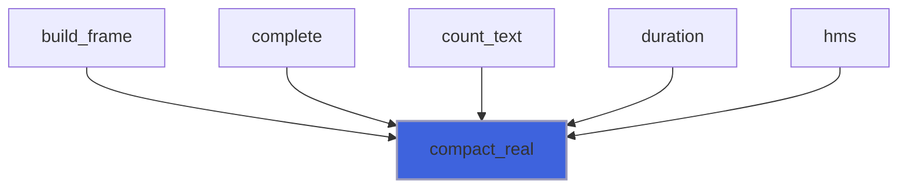

### count_text

**Attributes**: pure

**Returns**: `character(len=:)`

```fortran
function count_text(min_value, max_value, fraction) result(text)
```

**Arguments**

| Name | Type | Intent | Attributes | Description |
|------|------|--------|------------|-------------|
| `min_value` | real(kind=R8P) | in |  |  |
| `max_value` | real(kind=R8P) | in |  |  |
| `fraction` | real(kind=R8P) | in |  |  |

**Call graph**

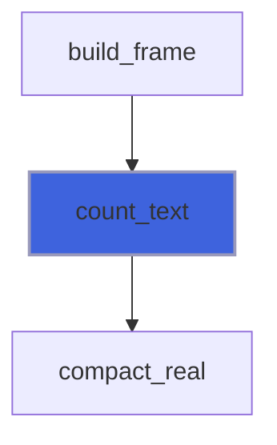

### duration

**Attributes**: pure

**Returns**: `character(len=:)`

```fortran
function duration(seconds) result(text)
```

**Arguments**

| Name | Type | Intent | Attributes | Description |
|------|------|--------|------------|-------------|
| `seconds` | real(kind=R8P) | in |  |  |

**Call graph**

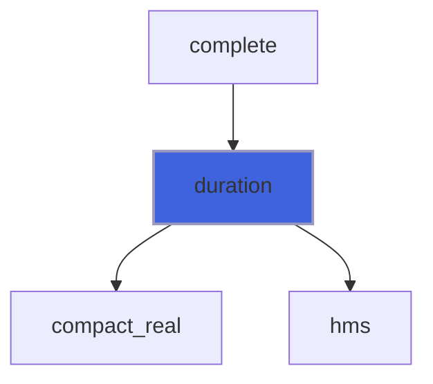

### get_environment

**Returns**: `logical`

```fortran
function get_environment(name, value) result(is_set)
```

**Arguments**

| Name | Type | Intent | Attributes | Description |
|------|------|--------|------------|-------------|
| `name` | character(len=*) | in |  |  |
| `value` | character(len=:) | out | allocatable |  |

**Call graph**

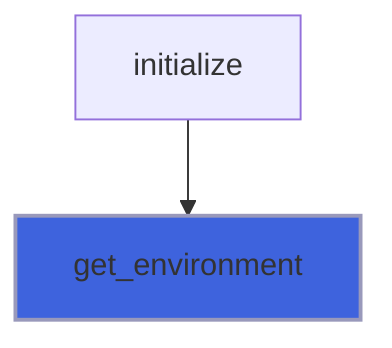

### hms

**Attributes**: pure

**Returns**: `character(len=8)`

```fortran
function hms(seconds) result(text)
```

**Arguments**

| Name | Type | Intent | Attributes | Description |
|------|------|--------|------------|-------------|
| `seconds` | real(kind=R8P) | in |  |  |

**Call graph**

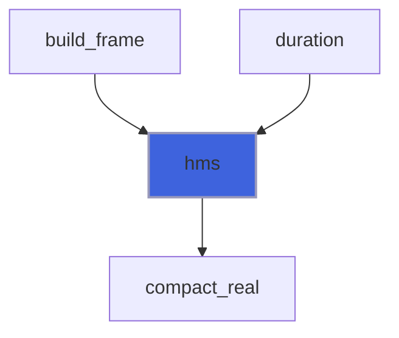

### is_terminal

**Returns**: `logical`

```fortran
function is_terminal(unit)
```

**Arguments**

| Name | Type | Intent | Attributes | Description |
|------|------|--------|------------|-------------|
| `unit` | integer(kind=I4P) | in |  |  |

**Call graph**

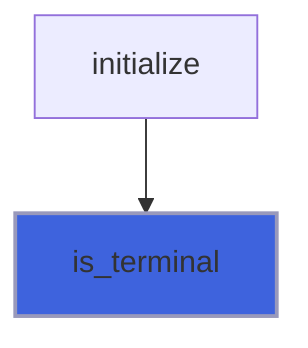

### render

**Attributes**: pure

**Returns**: character(kind=[UCS4](/api/src/third_party/FACE/src/lib/face), len=:)

```fortran
function render(element, plain) result(text)
```

**Arguments**

| Name | Type | Intent | Attributes | Description |
|------|------|--------|------------|-------------|
| `element` | type([element_object](/api/src/lib/forbear_element_object#element-object)) | in |  |  |
| `plain` | logical | in |  |  |

**Call graph**

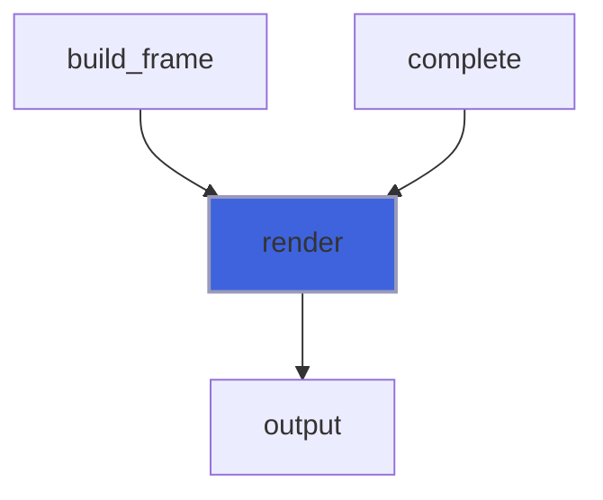
