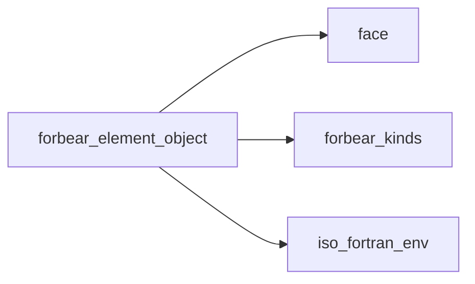
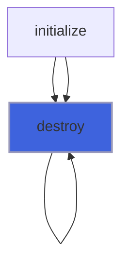
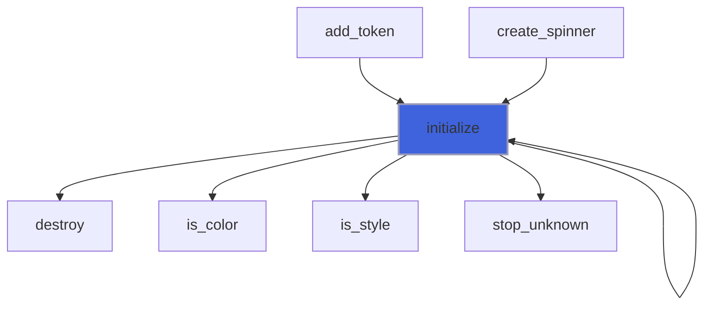
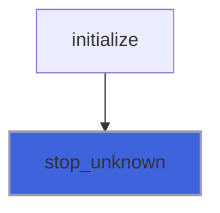
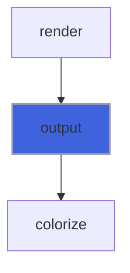
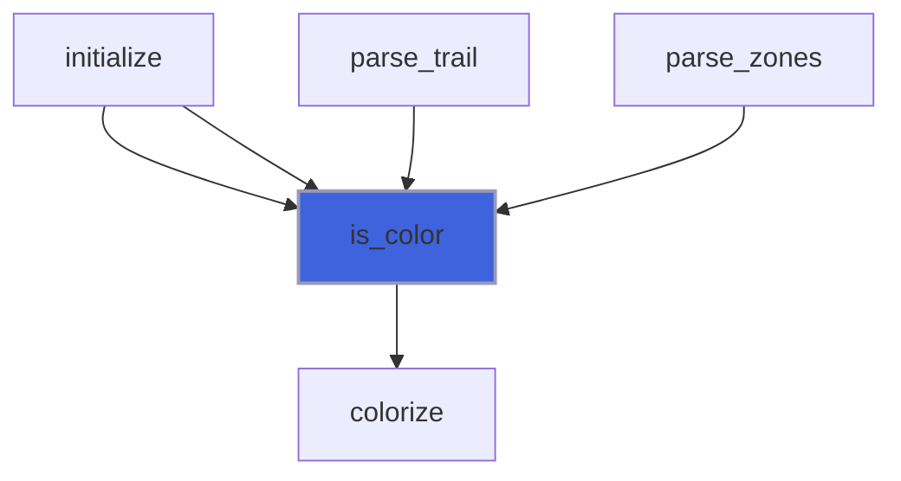
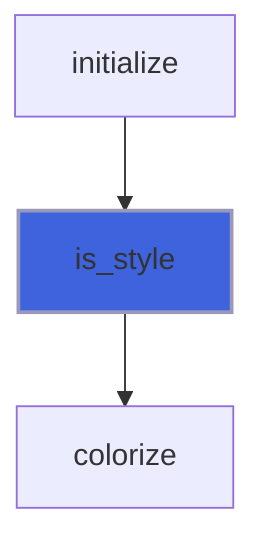

# forbear_element_object

**Source**: `src/lib/forbear_element_object.F90`

**Dependencies**



## Contents

- [element_object](#element-object)
- [destroy](#destroy)
- [initialize](#initialize)
- [stop_unknown](#stop-unknown)
- [assign_element](#assign-element)
- [output](#output)
- [is_color](#is-color)
- [is_style](#is-style)

## Derived Types

### element_object

#### Components

| Name | Type | Attributes | Description |
|------|------|------------|-------------|
| `string` | character(kind=[UCS4](/api/src/lib/forbear_kinds), len=:) | allocatable |  |
| `color_fg` | character(len=:) | allocatable |  |
| `color_bg` | character(len=:) | allocatable |  |
| `style` | character(len=:) | allocatable |  |

#### Type-Bound Procedures

| Name | Attributes | Description |
|------|------------|-------------|
| `destroy` | pass(self) |  |
| `initialize` | pass(self) |  |
| `output` | pass(self) |  |
| `assignment(=)` |  |  |
| `assign_element` | pass(lhs) |  |

## Subroutines

### destroy

**Attributes**: pure

```fortran
subroutine destroy(self)
```

**Arguments**

| Name | Type | Intent | Attributes | Description |
|------|------|--------|------------|-------------|
| `self` | class([element_object](/api/src/lib/forbear_element_object#element-object)) | inout |  |  |

**Call graph**



### initialize

```fortran
subroutine initialize(self, string, color_fg, color_bg, style)
```

**Arguments**

| Name | Type | Intent | Attributes | Description |
|------|------|--------|------------|-------------|
| `self` | class([element_object](/api/src/lib/forbear_element_object#element-object)) | inout |  |  |
| `string` | class(*) | in | optional |  |
| `color_fg` | character(len=*) | in | optional |  |
| `color_bg` | character(len=*) | in | optional |  |
| `style` | character(len=*) | in | optional |  |

**Call graph**



### stop_unknown

```fortran
subroutine stop_unknown(what, name)
```

**Arguments**

| Name | Type | Intent | Attributes | Description |
|------|------|--------|------------|-------------|
| `what` | character(len=*) | in |  |  |
| `name` | character(len=*) | in |  |  |

**Call graph**



### assign_element

**Attributes**: pure

```fortran
subroutine assign_element(lhs, rhs)
```

**Arguments**

| Name | Type | Intent | Attributes | Description |
|------|------|--------|------------|-------------|
| `lhs` | class([element_object](/api/src/lib/forbear_element_object#element-object)) | inout |  |  |
| `rhs` | type([element_object](/api/src/lib/forbear_element_object#element-object)) | in |  |  |

## Functions

### output

**Attributes**: pure

**Returns**: character(kind=[UCS4](/api/src/lib/forbear_kinds), len=:)

```fortran
function output(self)
```

**Arguments**

| Name | Type | Intent | Attributes | Description |
|------|------|--------|------------|-------------|
| `self` | class([element_object](/api/src/lib/forbear_element_object#element-object)) | in |  |  |

**Call graph**



### is_color

**Attributes**: pure

**Returns**: `logical`

```fortran
function is_color(name)
```

**Arguments**

| Name | Type | Intent | Attributes | Description |
|------|------|--------|------------|-------------|
| `name` | character(len=*) | in |  |  |

**Call graph**



### is_style

**Attributes**: pure

**Returns**: `logical`

```fortran
function is_style(name)
```

**Arguments**

| Name | Type | Intent | Attributes | Description |
|------|------|--------|------------|-------------|
| `name` | character(len=*) | in |  |  |

**Call graph**


