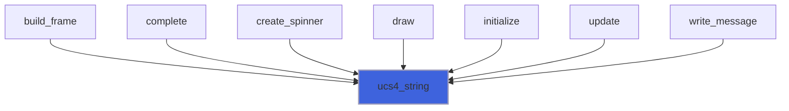

# forbear_kinds

**Source**: `src/lib/forbear_kinds.F90`

## Contents

- [ucs4_string](#ucs4-string)

## Variables

| Name | Type | Attributes | Description |
|------|------|------------|-------------|
| `ASCII` | integer | parameter |  |
| `UCS4` | integer | parameter |  |

## Functions

### ucs4_string

**Attributes**: pure

**Returns**: character(kind=[UCS4](/api/src/lib/forbear_kinds), len=:)

```fortran
function ucs4_string(input) result(output)
```

**Arguments**

| Name | Type | Intent | Attributes | Description |
|------|------|--------|------------|-------------|
| `input` | class(*) | in |  |  |

**Call graph**


