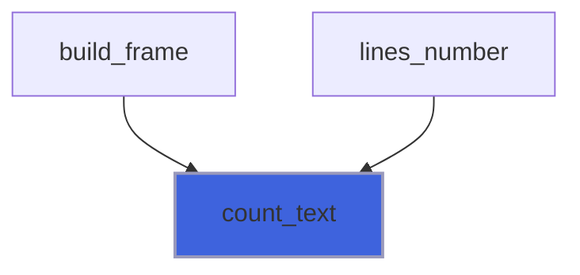
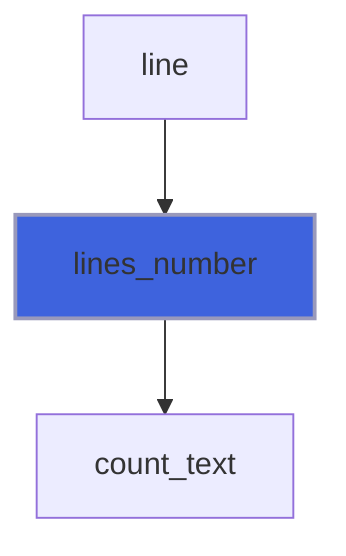
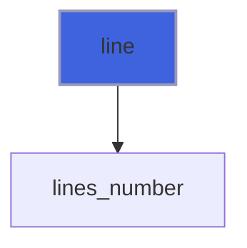

# forbear_test_tools

**Source**: `src/tests/forbear_test_tools.F90`

**Dependencies**


## Contents

- [check](#check)
- [report](#report)
- [capture_open](#capture-open)
- [capture_close](#capture-close)
- [count_text](#count-text)
- [lines_number](#lines-number)
- [line](#line)

## Variables

| Name | Type | Attributes | Description |
|------|------|------------|-------------|
| `ESC` | character(len=1) | parameter |  |
| `CR` | character(len=1) | parameter |  |
| `LF` | character(len=1) | parameter |  |
| `failures` | integer(kind=I4P) |  |  |

## Subroutines

### check

```fortran
subroutine check(condition, label)
```

**Arguments**

| Name | Type | Intent | Attributes | Description |
|------|------|--------|------------|-------------|
| `condition` | logical | in |  |  |
| `label` | character(len=*) | in |  |  |

### report

```fortran
subroutine report()
```

## Functions

### capture_open

**Returns**: `integer(kind=I4P)`

```fortran
function capture_open(file) result(unit)
```

**Arguments**

| Name | Type | Intent | Attributes | Description |
|------|------|--------|------------|-------------|
| `file` | character(len=*) | in |  |  |

### capture_close

**Returns**: `character(len=:)`

```fortran
function capture_close(unit, file) result(text)
```

**Arguments**

| Name | Type | Intent | Attributes | Description |
|------|------|--------|------------|-------------|
| `unit` | integer(kind=I4P) | in |  |  |
| `file` | character(len=*) | in |  |  |

### count_text

**Attributes**: pure

**Returns**: `integer(kind=I4P)`

```fortran
function count_text(text, pattern) result(n)
```

**Arguments**

| Name | Type | Intent | Attributes | Description |
|------|------|--------|------------|-------------|
| `text` | character(len=*) | in |  |  |
| `pattern` | character(len=*) | in |  |  |

**Call graph**



### lines_number

**Attributes**: pure

**Returns**: `integer(kind=I4P)`

```fortran
function lines_number(text) result(n)
```

**Arguments**

| Name | Type | Intent | Attributes | Description |
|------|------|--------|------------|-------------|
| `text` | character(len=*) | in |  |  |

**Call graph**



### line

**Attributes**: pure

**Returns**: `character(len=:)`

```fortran
function line(text, n) result(content)
```

**Arguments**

| Name | Type | Intent | Attributes | Description |
|------|------|--------|------------|-------------|
| `text` | character(len=*) | in |  |  |
| `n` | integer(kind=I4P) | in |  |  |

**Call graph**


