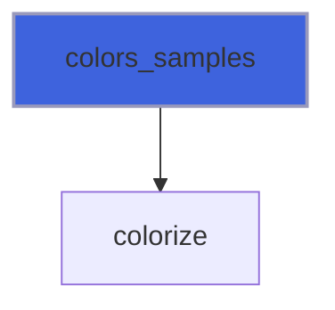
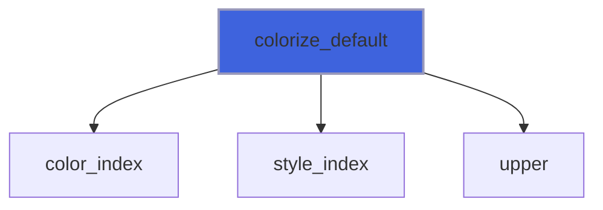
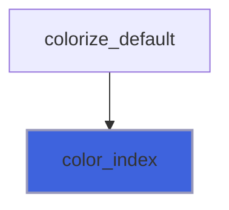
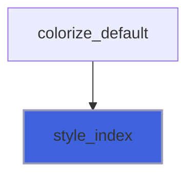
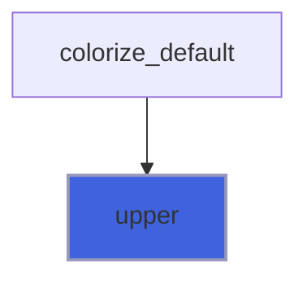

# face

**Source**: `src/third_party/FACE/src/lib/face.F90`

**Dependencies**


## Contents

- [colorize](#colorize)
- [colors_samples](#colors-samples)
- [styles_samples](#styles-samples)
- [colorize_default](#colorize-default)
- [color_index](#color-index)
- [style_index](#style-index)
- [upper](#upper)

## Variables

| Name | Type | Attributes | Description |
|------|------|------------|-------------|
| `ASCII` | integer | parameter |  |
| `UCS4` | integer | parameter |  |
| `UPPER_ALPHABET` | character(len=26) | parameter |  |
| `LOWER_ALPHABET` | character(len=26) | parameter |  |
| `NL` | character(len=1) | parameter |  |
| `ESCAPE` | character(len=1) | parameter |  |
| `CODE_START` | character(len=2) | parameter |  |
| `CODE_END` | character(len=1) | parameter |  |
| `CODE_CLEAR` | character(len=4) | parameter |  |
| `STYLES` | character(len=17) | parameter |  |
| `COLORS_FG` | character(len=15) | parameter |  |
| `COLORS_BG` | character(len=15) | parameter |  |

## Interfaces

### colorize

**Module procedures**: [`colorize_default`](/api/src/third_party/FACE/src/lib/face#colorize-default)

## Subroutines

### colors_samples

```fortran
subroutine colors_samples()
```

**Call graph**



### styles_samples

```fortran
subroutine styles_samples()
```

**Call graph**


## Functions

### colorize_default

**Attributes**: pure

**Returns**: `character(len=:)`

```fortran
function colorize_default(string, color_fg, color_bg, style) result(colorized)
```

**Arguments**

| Name | Type | Intent | Attributes | Description |
|------|------|--------|------------|-------------|
| `string` | character(len=*) | in |  |  |
| `color_fg` | character(len=*) | in | optional |  |
| `color_bg` | character(len=*) | in | optional |  |
| `style` | character(len=*) | in | optional |  |

**Call graph**



### color_index

**Attributes**: elemental

**Returns**: `integer(kind=int32)`

```fortran
function color_index(color)
```

**Arguments**

| Name | Type | Intent | Attributes | Description |
|------|------|--------|------------|-------------|
| `color` | character(len=*) | in |  |  |

**Call graph**



### style_index

**Attributes**: elemental

**Returns**: `integer(kind=int32)`

```fortran
function style_index(style)
```

**Arguments**

| Name | Type | Intent | Attributes | Description |
|------|------|--------|------------|-------------|
| `style` | character(len=*) | in |  |  |

**Call graph**



### upper

**Attributes**: elemental

**Returns**: `character(len=len)`

```fortran
function upper(string)
```

**Arguments**

| Name | Type | Intent | Attributes | Description |
|------|------|--------|------------|-------------|
| `string` | character(len=*) | in |  |  |

**Call graph**


