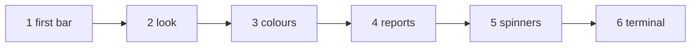

# The tutorial

The tutorial teaches forbear by growing the progress bar of one program, step by step. The [cookbook](./cookbook) then
collects short recipes for everyday tasks, and the [reference](/guide/features) has every keyword and every default.

## The chapters

The tutorial gives a progress bar to `march`, a (pretend) solver that advances its solution for 50 time steps. Each
chapter is a complete program that you can compile and run; every output shown is the real output of that program.

| Chapter | You learn |
|---|---|
| [1. A first bar](./tutorial/01-first-bar) | `initialize`, `start`, `update`; the range of the bar |
| [2. The look of the bar](./tutorial/02-look) | prefix, suffix, brackets, filled and empty characters, width, Unicode |
| [3. Colours and styles](./tutorial/03-colours) | foreground, background and style of every element |
| [4. What the bar reports](./tutorial/04-reports) | progress in percent, progress speed, start and end time, scale |
| [5. Spinners and counters](./tutorial/05-spinners) | a spinner next to the bar, a spinner or a percentage alone |
| [6. Sharing the terminal](./tutorial/06-terminal) | other output while the bar runs, standard error, update frequency |



## The cookbook

[The cookbook](./cookbook) answers "how do I ...?" in a few lines each: a Unicode bar, a spinner, a loop of a million
iterations, a bar on standard error, messages that wait for the bar to finish, ...

## Building the examples

Every program of the tutorial and of the cookbook is in
[`docs/examples/src`](https://github.com/szaghi/forbear/tree/master/docs/examples/src). With forbear built by FoBiS
(`fobis build --mode static-gnu`, see [Installation](/guide/install)):

```bash
gfortran -I static/mod docs/examples/src/march_1.f90 static/libforbear.a -o march
./march
```

`bash scripts/docs_examples.sh` builds and runs all of them, regenerating the outputs shown in these pages. A bar
redraws its line many times: an output shows what the terminal displays at the end of the run, or, when it is labelled
*while running*, in the middle of it. The progress speed and the dates change from a run to the next: the outputs show
them as `nn.nn` and `yyyy/mm/dd hh:mm:ss`.
