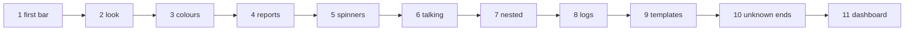

# The tutorial

The tutorial teaches forbear by growing the progress bar of one program, step by step. The [cookbook](./cookbook) then
collects short recipes for everyday tasks, and the [reference](/guide/features) has every keyword and every default.

## The chapters

The tutorial gives a progress bar to `march`, a (pretend) solver that advances its solution for 50 time steps. Each
chapter is a complete program that you can compile and run; every output shown is the real output of that program, and
every chapter opens with a recording of it in a real terminal.

| Chapter | You learn |
|---|---|
| [1. A first bar](./tutorial/01-first-bar) | `initialize`, `start`, `update`; the range of the bar |
| [2. The look of the bar](./tutorial/02-look) | prefix, suffix, brackets, filled and empty characters, width, Unicode |
| [3. Colours and styles](./tutorial/03-colours) | foreground, background and style of every element |
| [4. What the bar reports](./tutorial/04-reports) | progress in percent, progress speed, start and end time, scale |
| [5. Spinners and counters](./tutorial/05-spinners) | a spinner next to the bar, a spinner or a percentage alone |
| [6. Talking while the bar runs](./tutorial/06-terminal) | lines above the bar, a message at its end, how often it is drawn |
| [7. Nested loops](./tutorial/07-nested) | one bar per loop level, each on its own line |
| [8. Batch jobs and logs](./tutorial/08-logs) | the plain log of a batch job, turning bars off, MPI |
| [9. Layout templates](./tutorial/09-templates) | a line laid out by a template, fields of the program |
| [10. Unknown ends](./tutorial/10-unknown-ends) | a loop of unknown length, a loop left before its end |
| [11. A 1980s dashboard](./tutorial/11-dashboard) | 24-bit colours, colour zones, a ramp, a scanner, seven-segment digits, themes |



## The cookbook

[The cookbook](./cookbook) answers "how do I ...?" in a few lines each: a smooth bar, an ETA, a loop of a million
iterations, a message above the bar, a bar for each loop of a nest, a quiet bar on the MPI ranks, a loop of unknown length, ...

## Building the examples

Every program of the tutorial and of the cookbook is in
[`docs/examples/src`](https://github.com/szaghi/forbear/tree/master/docs/examples/src). With forbear built by FoBiS
(`fobis build --mode static-gnu`, see [Installation](/guide/install)):

```bash
gfortran -I static/mod docs/examples/src/march_1.f90 static/libforbear.a -o march
./march
```

`bash scripts/docs_examples.sh` builds and runs all of them, regenerating the outputs shown in these pages. A bar
redraws its line many times: an output shows what the terminal displays at the end of the run, or, when it is labelled
*while running*, in the middle of it. The progress speed, the ETA, the summary and the dates change from a run to the
next: the outputs show them as `nn.nn`, `hh:mm:ss`, `n.nn s` and `yyyy/mm/dd hh:mm:ss`. `bash scripts/docs_gifs.sh`
records the animations with [VHS](https://github.com/charmbracelet/vhs).
